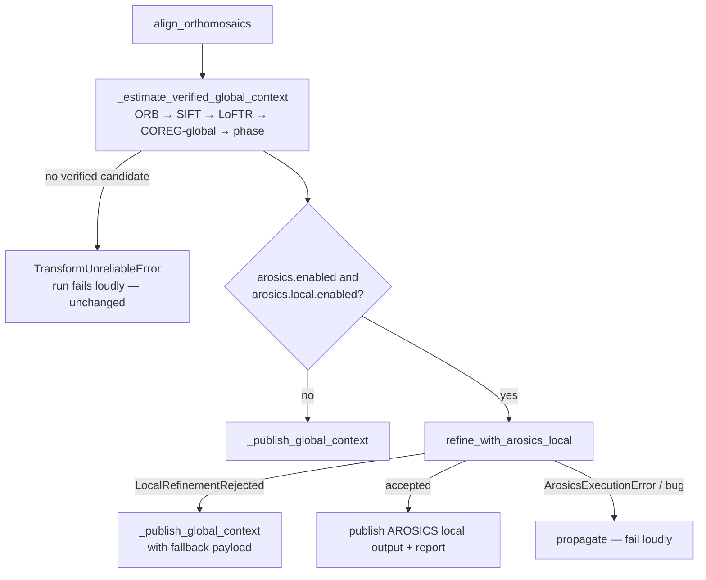
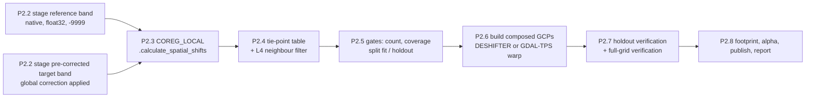

# Alignment Engine v4 — AROSICS Local Warp & Manual TPS Remediation Blueprint

Status: **Approved design, not yet implemented**
Date: 2026-09-18
Scope: `drone_alignment` automated mode (AROSICS), manual mode (control-point TPS), shared field infrastructure.
Supersedes: the AROSICS sections of `AROSICS_IMPLEMENTATION_STATUS.md`.

---

## 0. How to read this document

| Section | Purpose |
|---|---|
| 1 | Decision record — what we are building and why |
| 2 | Findings being fixed, with traceability to phases |
| 3 | Target architecture and control flow |
| 4 | Phase 0 — hotfixes (ship first, independently) |
| 5 | Phase 1 — shared infrastructure |
| 6 | Phase 2 — AROSICS coarse-to-fine local warp (main work) |
| 7 | Phase 3 — manual control-point alignment rewrite |
| 8 | Phase 4 — CLI, runner script, configuration migration, docs |
| 9 | Phase 5 — validation on real data and acceptance |
| 10 | Test plan (complete list) |
| 11 | Risks, open questions, revisit triggers |

Conventions used throughout:

- **Registration px** — pixels of `coarse.registration_transform` (≤ `registration_max_dimension` per side).
- **Native px** — pixels of `coarse.output_profile` (MS GSD in `ms` resolution mode).
- **Target px** — pixels of the MS raster as AROSICS sees it (`X_IM`, `Y_IM`).
- **Reference px** — pixels of the RGB raster. AROSICS `max_shift` and `window_size` are in reference px.
- Pixel coordinates are **corner-based** (pixel `(0,0)` spans `[0,1)×[0,1)`), matching rasterio `Affine` and GDAL GCP `GCPPixel/GCPLine`.
- "Rejection" means an *expected* safety-gate failure that falls back to the verified global result. "Error" means an operational/programming failure that propagates. This split already exists for local correlation (`LocalCorrelationRejected`) and is extended here.

---

## 1. Decision record

### 1.1 AROSICS performs the local warp

AROSICS is a complete co-registration system: tie-point detection, multi-level filtering (reliability → SSIM → RANSAC), and GCP-based warping through GDAL's thin-plate-spline transformer (`DESHIFTER` → `py_tools_ds.warp_ndarray` → `gdal.Warp(tps=True)`). **We use it end-to-end, including the warp.**

What changes is *how* we drive it, bringing usage back in line with the tool's own design and documentation:

1. **Coarse-to-fine order.** AROSICS local mode is designed for small residual misregistration (`COREG_LOCAL` default `max_shift=5`; the authors describe it as sub-pixel-scale correction). Our verified global alignment (ORB/SIFT/LoFTR/COREG-global) runs first; AROSICS local refines it. Today the order is inverted (local first with `max_shift=50`, global as fallback).
2. **AROSICS defaults restored.** `min_reliability=60` (we use 30), `tieP_filter_level=3`, small `max_shift`.
3. **No pre-resampling of inputs.** The AROSICS docs: *"Please do not perform any spatial resampling of the input images before applying this algorithm."* Matching bands are staged at native resolution; only an unavoidable global-rotation pre-correction (rare) resamples the single matching band.
4. **Verification recommended by AROSICS.** The docs recommend inspecting tie points and *"reinitializ[ing] COREG_LOCAL with the corrected output to assess remaining shifts."* We automate this with a proper holdout so the check is not self-confirming.
5. **Output on the pipeline's grid.** `target_xyGrid` + `clipextent` put AROSICS output on `coarse.output_profile`, identical to every other mode.

### 1.2 Why verification gates exist (not "leashes")

- Every other engine (ORB, SIFT, LoFTR, cell correlation, local mesh) must pass independent QA before publication. AROSICS is currently the only exemption. v4 removes the exemption; it does not restrict the algorithm.
- AROSICS was designed and validated on 10–30 m satellite imagery. Our imagery is 2–6 cm drone orthomosaics over periodic crop rows, where a one-row-period false match can raise window SSIM and survive RANSAC. The gates are how we *measure* whether that happens on our data.
- GDAL TPS interpolates exactly through every GCP, so a surviving false tie point bends the output locally. Holdout verification is the only way to see this.

### 1.3 Revisit triggers

Switch to "AROSICS supplies tie points, pipeline warps" (the alternative design, see §11.3) **only if** Phase 5 real-data runs show one of:

- holdout verification repeatedly rejecting runs whose tie points look correct (TPS artefacts between points),
- DESHIFTER and the streaming GDAL engine both exceeding memory/time budgets,
- visible local bulges along crop rows in QGIS inspection.

---

## 2. Findings and traceability

### 2.1 AROSICS

| ID | Finding | Resolved in |
|---|---|---|
| A1 | `match_arosics` reads `coreg.reliability`; AROSICS exposes `shift_reliability` (`CoReg.py:410`). Gate never fires; `inlier_ratio` always 1.0. Unit tests pass only because a bare `MagicMock` fabricates attributes. | P0.1 |
| A2 | Local-first/global-fallback order is inverted relative to AROSICS design. | P2 |
| A3 | Local result has no independent QA; quality is hard-coded `PASS`. `success` only means `GCPList != []`. | P2.7 |
| A4 | `min_reliability` default 30 vs AROSICS 60. | P0.2, P2 |
| A5 | Exact TPS warp + weak filters + min 6 points + no coverage gate. | P2.5, P2.7 |
| A6 | `max_shift=50` reference px ≈ 1 m at 2 cm GSD ≈ crop-row period → aliasing risk. | P2.3 |
| A7 | `align_grids` silently keeps the MS grid when GSDs are not integer multiples; output grid/extent differ from other modes. | P2.6 |
| A8 | DESHIFTER loads the full MS raster into RAM (`DeShifter.py:365`); `cubic` resampling on reflectance. | P2.6 |
| A9 | `nodata=(None, None)` → corner-based autodetection; our internal GDAL mask is not read by GeoArray. | P2.2 |
| A10 | Global `match_arosics` runs on resampled registration bands; unreachable in automated mode (`fallback_cfg.arosics.enabled = False`). | P0.1, P2.1 |
| A11 | Report records `mean_shifts_px` as the transform; no tie-point export; only `band_pairs[0]` used; bare `except Exception` converts programming errors into silent fallback. | P2.8, P2.9 |

### 2.2 Manual TPS

| ID | Finding | Resolved in |
|---|---|---|
| M1 | QA evaluates the interpolating TPS at its own control points → RMSE ≈ 0, always `PASS`. | P3.5 |
| M2 | Affine rotation/scale bounds bypassed: TPS degree-1 polynomial re-absorbs the rejected geometry. | P3.4 |
| M3 | Footprint checks use the affine baseline only; field-aware check exists but unused. | P0.4 |
| M4 | LMEDS baseline treats disagreeing GCPs as outliers, exact TPS then forces through them. | P3.3 |
| M5 | No fold-over / Jacobian check. | P3.5 |
| M6 | Duplicate points → uncaught `LinAlgError`; collinearity via exact rank on RGB points only. | P0.3, P3.2 |
| M7 | Taper `s/(s+w)` ≠ 1 at an isolated control point; density-dependent; also active in local correlation (`w=0.2`). | P1.2 |
| M8 | Taper allocates `(pixels × controls × 2)` float64 (≈1.3 GB per 2048² tile at 20 controls); RBF evaluated at every native pixel. | P1.1, P1.2 |
| M9 | Model chosen by count only; 3-point "TPS" ≡ affine; no-SciPy silently drops to translation; 2 points ignore similarity. | P3.4 |
| M10 | Translation bound measured at image origin, not centroid. | P3.4 |
| M11 | Pixel convention ambiguous; CLI hard-codes EPSG:32642; MS map points pass through RGB-CRS transform. | P3.1 |
| M12 | No GCP table/LOO in report; no GCP file import; no check points. | P3.1, P3.7 |

---

## 3. Target architecture

### 3.1 Module map

```
drone_alignment/
  alignment/
    arosics_matcher.py        MODIFY  global COREG candidate (A1 fix); legacy run_arosics_local removed
    arosics_local.py          NEW     coarse-to-fine COREG_LOCAL: staging, tie points, gates, warp, verification
    arosics_staging.py        NEW     raster staging helpers (moved from arosics_matcher + new pre-correction)
    control_points.py         NEW     shared GCP core: validation, baselines, robust residuals, model selection, LOO
    manual.py                 REWRITE thin adapter over control_points.py
    field_eval.py             NEW     GridSampledField (lattice evaluation + bilinear lookup)
    displacement_field.py     MODIFY  taper fix, chunked evaluation
    warper.py                 MODIFY  wrap fields in GridSampledField; written-raster footprint helper
  io/
    gcp_io.py                 NEW     CSV / QGIS .points import, roles, pixel convention
  config/schema.py            MODIFY  ArosicsConfig split (global_candidate / local); ManualAlignmentConfig
  quality/report.py           MODIFY  generic `local_refinement` and `manual_control_points` payloads
  pipeline.py                 MODIFY  automated flow; manual flow; shared rejection type
  cli.py                      MODIFY  new flags
scripts/run-alignment.ps1     MODIFY  new parameters
```

### 3.2 Automated-mode control flow (v4)



### 3.3 `refine_with_arosics_local` internal pipeline



### 3.4 Rejection taxonomy (shared)

Generalize `LocalCorrelationRejected` in `pipeline.py` into a module-level type in `alignment/rejections.py`:

```python
class LocalRefinementRejected(RuntimeError):
    """Expected local safety-gate rejection; global publication remains safe."""
    def __init__(self, reason_code: str, message: str, details: dict | None = None): ...

LocalCorrelationRejected = LocalRefinementRejected   # backwards-compatible alias
```

AROSICS reason codes:

| Code | Meaning |
|---|---|
| `AROSICS_UNAVAILABLE` | package/GDAL import failed |
| `UNSUPPORTED_GLOBAL_TRANSFORM` | global result is a homography |
| `UNSUPPORTED_CRS` | RGB and MS CRS differ (DESHIFTER does not implement cross-projection warping; see its `FIXME equal_prj==False`) |
| `INSUFFICIENT_TIE_POINTS` | valid points after all filters < `min_valid_tie_points` |
| `INSUFFICIENT_COVERAGE` | cell occupancy or hull coverage below threshold |
| `NO_LOCAL_GAIN` | holdout "before" residual already below `no_gain_floor_px` — global is good enough |
| `HOLDOUT_FAILED` | holdout improvement / win fraction / max residual gate failed |
| `VERIFICATION_FAILED` | full-grid post-warp verification failed |
| `FOOTPRINT_FAILED` | written output fails retained/overlap ratios |
| `MEMORY_BUDGET` | both warp engines disallowed by budget (only if `warp_engine` is pinned) |

---

## 4. Phase 0 — Hotfixes (independent PR, ship first)

Each item is small and independently testable. No behaviour change beyond the fix.

### P0.1 Fix AROSICS global reliability gate (A1, A10 partial)

File: `drone_alignment/alignment/arosics_matcher.py`

```python
# before
reliability = getattr(coreg, "reliability", None)
if reliability is not None and reliability < arosics_config.min_reliability: ...
inlier_ratio = (float(reliability) / 100.0) if reliability is not None else 1.0

# after
reliability = getattr(coreg, "shift_reliability", None)
if reliability is None or not np.isfinite(reliability):
    raise InsufficientMatchesError("AROSICS COREG did not report a shift reliability.")
if reliability < arosics_config.min_reliability:
    raise InsufficientMatchesError(...)
inlier_ratio = float(reliability) / 100.0
```

Also:

- Remove the fabricated CRS fallback `"EPSG:32632"`; `crs` is guaranteed by `validate_inputs`. Pass `crs` as-is; raise `ArosicsExecutionError` if `None`.
- Replace the bare `except Exception` around `COREG(...)` with `except (RuntimeError, ValueError, AssertionError)` → `InsufficientMatchesError`. Let everything else propagate.

Note: AROSICS sets `shift_reliability` only when a non-zero shift is found (`CoReg.py:1622-1629`). An exactly-zero shift therefore also fails the gate. Acceptable: a verified global candidate already exists ahead of COREG in the candidate order; COREG-global is the last feature-free candidate.

Tests (`tests/test_arosics_matcher.py`):

- Replace every `MagicMock()` COREG instance with `MagicMock(spec=["calculate_spatial_shifts", "success", "x_shift_px", "y_shift_px", "shift_reliability"])`. A wrong attribute name must now raise `AttributeError` in tests.
- `test_match_arosics_missing_reliability_rejects`
- `test_match_arosics_real_coreg_known_shift` (skip if `arosics` not importable): synthetic textured raster, target shifted by `(+3.4, −2.1)` registration px via rasterio transform offset; assert recovered matrix translation within 0.2 px and correct sign.

### P0.2 Restore AROSICS reliability default (A4)

`schema.py`: `ArosicsConfig.min_reliability` default `30.0 → 60.0`. (Moves into nested configs in P2; the default carries over.)

### P0.3 Manual TPS input hardening (M6)

File: `drone_alignment/alignment/manual.py`

- Reject duplicate/near-duplicate control points: pairwise distance < 1.0 registration px in **either** RGB or MS set → `TransformUnreliableError("Control points #i and #j are closer than 1 registration pixel ...")`.
- Replace exact-rank collinearity with a conditioning test on both point sets: centred coordinates → singular values `σ1 ≥ σ2`; reject if `σ2/σ1 < 1e-3`.
- Wrap both `RBFInterpolator(...)` calls: `except np.linalg.LinAlgError as exc: raise TransformUnreliableError("... singular TPS system ...") from exc`.

Tests: `test_manual_tps_duplicate_points_rejected`, `test_manual_tps_near_collinear_rejected`, `test_manual_tps_singular_system_is_clean_error`.

### P0.4 Field-aware footprint in manual mode (M3)

File: `drone_alignment/pipeline.py` (`manual_align_orthomosaics`)

```python
if field is not None:
    native_footprint = evaluate_native_displacement_footprint(
        rgb_meta, ms_meta, coarse, native_transform, field, cfg.warp.tile_size)
else:
    native_footprint = evaluate_native_footprint(rgb_meta, ms_meta, coarse, native_transform, cfg.warp.tile_size)
```

Test: `test_manual_tps_footprint_uses_field` — monkeypatch both evaluators, assert the displacement one is called when TPS is selected.

**P0 exit criteria:** full test suite green; no config or CLI changes other than the P0.2 default.

---

## 5. Phase 1 — Shared infrastructure

### P1.1 `alignment/field_eval.py` — GridSampledField (M8)

Purpose: evaluate any `ResidualField` once on a coarse lattice in registration px, then answer `evaluate(xy)` by bilinear lookup. Removes per-native-pixel RBF evaluation and the taper memory blow-up for **all** field types (manual TPS, local-correlation TPS/mesh).

```python
@dataclass(frozen=True)
class GridSampledField:
    """Lattice-cached residual field (registration px in, registration px out)."""
    lattice_dx: np.ndarray          # [ny, nx] float32
    lattice_dy: np.ndarray          # [ny, nx] float32
    step_px: float                  # lattice spacing in registration px
    max_interp_error_px: float      # measured, reported
    name: str

    def evaluate(self, xy: np.ndarray) -> np.ndarray:
        pts = np.asarray(xy, np.float64).reshape(-1, 2)
        fx = (pts[:, 0] / self.step_px).astype(np.float32)
        fy = (pts[:, 1] / self.step_px).astype(np.float32)
        dx = cv2.remap(self.lattice_dx, fx.reshape(1, -1), fy.reshape(1, -1),
                       cv2.INTER_LINEAR, borderMode=cv2.BORDER_REPLICATE).ravel()
        dy = ...same for lattice_dy...
        return np.column_stack([dx, dy]).astype(np.float64)


def sample_field_on_lattice(field: ResidualField, registration_shape: tuple[int, int],
                            step_px: float = 4.0, max_error_px: float = 0.05,
                            max_refinements: int = 2, chunk: int = 262_144) -> GridSampledField:
    """Evaluate field at lattice nodes (chunked), then measure error at cell midpoints.
    If max error > max_error_px, halve step and retry (≤ max_refinements)."""
```

Notes:

- `cv2.remap` limits map sizes to < 32767 per dimension; call it per chunk of ≤ 32 000 points (reshape `(1, n)`).
- Nodes cover `[0, W] × [0, H]` inclusive (`nx = ceil(W/step)+1`).
- The error test samples the exact field at all cell midpoints of a 64×64 subsample of cells; the worst error is recorded in the report. At 4 registration px step, typical fields are far below 0.05 px because fields are smooth by construction (gradient gate ≤ 0.15).

Integration in `warper.py`:

- `warp_ms_with_displacement_field_tiled` and `evaluate_native_displacement_footprint` wrap the incoming field once: `field = ensure_grid_sampled(field, registration_shape)` (no-op if already a `GridSampledField`).
- `_native_residual_maps` is unchanged; it now calls a cheap `evaluate`.

Tests (`tests/test_field_eval.py`):

- `test_grid_sampled_matches_exact_tps_within_tolerance` (smooth TPS, max error < 0.05 px)
- `test_grid_sampled_refines_step_when_error_high` (high-curvature synthetic field)
- `test_grid_sampled_evaluate_large_input_chunked` (> 32 767 points)
- `test_warper_uses_grid_sampled_field` (spy on `field.evaluate` call count = lattice nodes only)

### P1.2 Taper fix and chunked evaluation (M7, M8)

File: `drone_alignment/alignment/displacement_field.py` and `manual.py`

Replace density-summed support with nearest-control support, renormalized so the taper is exactly 1 at every control point:

```python
def nearest_support(points, control_xy, sigma_px, tree=None, chunk=262_144):
    tree = tree or cKDTree(control_xy)
    out = np.empty(len(points))
    for s in range(0, len(points), chunk):
        d, _ = tree.query(points[s:s+chunk], k=1)
        out[s:s+chunk] = np.exp(-d**2 / (2 * sigma_px**2))
    return out

def renormalized_taper(support, fallback_weight):
    # 1 at a control point (support=1), → 0 far away, monotone in support.
    if fallback_weight <= 0: return np.ones_like(support)
    return support * (1.0 + fallback_weight) / (support + fallback_weight)
```

- `TaperedThinPlateSplineField.evaluate` and `ManualThinPlateSplineField.evaluate` use it; the `KDTree` is built once in `__post_init__` (store via `object.__setattr__` because dataclasses are frozen).
- **Behaviour change in local-correlation mode** (`field_fallback_weight=0.2`): the field now honours its control vectors exactly and no longer inflates in dense clusters. Re-baseline `test_displacement_field.py` and `test_local_correlation_pipeline.py` expectations; document in changelog.
- Confidence weighting in `TaperedThinPlateSplineField` is dropped from the taper (it was only used there); confidence still enters via sample filtering. Record in changelog.

Tests: `test_taper_is_one_at_control_points`, `test_taper_decays_to_zero_far_away`, `test_taper_independent_of_point_density`, `test_taper_memory_bounded` (evaluate 4.2 M points with 50 controls; assert no allocation > 256 MB using `tracemalloc` peak).

### P1.3 Written-raster footprint helper

File: `drone_alignment/alignment/warper.py`

```python
def evaluate_written_footprint(rgb_meta, ms_meta, aligned_path, profile, tile_size) -> FootprintMetrics:
    """Footprint metrics measured on an already-written aligned raster (mask or alpha),
    against the RGB valid mask and the baseline (unwarped) MS mask on the same grid."""
```

Used by AROSICS publication (P2.8), because the AROSICS warp is not expressible as our affine/field map. Reuses `_reproject_valid_mask` and `_windows`.

Test: `test_written_footprint_matches_affine_footprint_for_translation`.

### P1.4 Rejection type

Create `alignment/rejections.py` (§3.4). Replace the class in `pipeline.py` with an import + alias. No behaviour change.

### P1.5 Report extension

File: `quality/report.py` — add keyword-only parameters:

```python
local_refinement: dict | None = None,        # AROSICS local payload (P2.9)
manual_control_points: dict | None = None,   # manual payload (P3.7)
```

Serialized under keys `"local_refinement"` and `"manual_control_points"`. Existing `local_correlation` key unchanged.

**P1 exit criteria:** suite green; local-correlation integration test output within 0.1 native px of pre-P1 output except where the taper change applies (documented).

---

## 6. Phase 2 — AROSICS coarse-to-fine local warp

### P2.0 Configuration (replaces current `ArosicsConfig`)

```python
class ArosicsGlobalCandidateConfig(BaseModel):
    """COREG (global) as a feature-free candidate inside global estimation."""
    enabled: bool = True
    window_size: tuple[int, int] = (256, 256)
    max_shift_px: int = Field(50, gt=1, le=500)        # registration px; large offsets are this stage's job
    min_reliability: float = Field(60.0, ge=0.0, le=100.0)


class ArosicsLocalConfig(BaseModel):
    """COREG_LOCAL refinement of the verified global result; AROSICS performs the warp."""
    enabled: bool = True
    # --- tie-point grid ---
    target_points_per_axis: int = Field(16, ge=4, le=128)   # grid_res = ceil(max(W,H) / this), target px
    grid_res_px: int | None = Field(None, ge=16)            # explicit override
    window_size: tuple[int, int] = (256, 256)               # reference px
    max_shift_m: float | None = Field(None, gt=0.0, le=5.0) # None = auto (P2.3)
    max_iter: int = Field(5, ge=1, le=20)
    # --- AROSICS filtering (library defaults) ---
    min_reliability: float = Field(60.0, ge=0.0, le=100.0)
    tie_point_filter_level: int = Field(3, ge=0, le=3)
    rs_max_outlier: float = Field(10.0, gt=0.0, le=50.0)
    rs_tolerance: float = Field(2.5, gt=0.0, le=20.0)
    # --- our additional filter (L4) ---
    neighbour_filter: bool = True
    neighbour_k: int = Field(6, ge=3, le=16)
    max_neighbour_deviation_px: float = Field(2.0, gt=0.0)  # target (MS) px
    # --- pre-warp gates ---
    min_valid_tie_points: int = Field(12, ge=6)
    coverage_grid: int = Field(4, ge=2, le=16)
    min_cell_occupancy: float = Field(0.5, gt=0.0, le=1.0)
    min_hull_coverage: float = Field(0.30, gt=0.0, le=1.0)
    # --- holdout / verification ---
    holdout_fraction: float = Field(0.20, gt=0.0, lt=0.5)
    min_holdout_points: int = Field(4, ge=3)
    no_gain_floor_px: float = Field(0.5, ge=0.0)            # target px
    max_holdout_ratio: float = Field(0.70, gt=0.0, le=1.0)  # median_after ≤ ratio × median_before
    min_holdout_win_fraction: float = Field(0.60, ge=0.0, le=1.0)
    max_holdout_after_px: float = Field(2.0, gt=0.0)
    full_grid_verification: bool = True
    max_verification_p90_px: float = Field(1.5, gt=0.0)
    # --- warp ---
    warp_engine: Literal["auto", "deshifter", "gdal_tps"] = "auto"
    max_in_memory_warp_gb: float = Field(4.0, gt=0.0)
    gdal_warp_memory_mb: int = Field(512, ge=64)
    resampling: Literal["bilinear", "cubic", "nearest"] = "bilinear"
    # --- domain guard ---
    periodic_texture_period_m: float | None = Field(None, gt=0.0)   # e.g. 0.75 for cotton rows
    # --- output ---
    export_tie_points: bool = True
    cpus: int | None = None


class ArosicsConfig(BaseModel):
    enabled: bool = True
    band_pairs: list[ArosicsBandPair] = Field(default_factory=list)
    global_candidate: ArosicsGlobalCandidateConfig = Field(default_factory=ArosicsGlobalCandidateConfig)
    local: ArosicsLocalConfig = Field(default_factory=ArosicsLocalConfig)

    @model_validator(mode="before")
    @classmethod
    def _migrate_legacy_keys(cls, data): ...   # see §8.3
```

Validator rules (`model_validator(mode="after")` on `ArosicsLocalConfig`):

- `min_holdout_points < min_valid_tie_points * holdout_fraction` is **not** required, but `min_valid_tie_points - ceil(min_valid_tie_points*holdout_fraction) ≥ 6` is (enough fit points for a TPS that is not merely affine).
- `window_size` elements ≥ 32 and even.

### P2.1 Pipeline entry points

File: `pipeline.py`

```python
def align_orthomosaics(rgb_path, ms_path, output_dir, config=None, log=None) -> AlignmentResult:
    active_log = log or logger
    cfg = config or AlignmentConfig()
    output_dir_obj = _prepare_output_dir(output_dir)
    context = _estimate_verified_global_context(rgb_path, ms_path, cfg, active_log)   # COREG-global now reachable
    requested = AlignmentMode.AUTOMATED.value
    if cfg.arosics.enabled and cfg.arosics.local.enabled:
        try:
            return refine_with_arosics_local(context, output_dir_obj, cfg, active_log)
        except LocalRefinementRejected as rejection:
            active_log.warning("AROSICS local refinement rejected (%s): %s", rejection.reason_code, rejection)
            return _publish_global_context(
                context, output_dir_obj, cfg, active_log,
                requested_alignment_mode=requested, applied_alignment_mode="automated_global",
                fallback={"stage": "arosics_local", "reason_code": rejection.reason_code,
                          "message": str(rejection), "details": rejection.details},
            )
    return _publish_global_context(context, output_dir_obj, cfg, active_log,
                                   requested_alignment_mode=requested, applied_alignment_mode="automated_global")
```

- Delete `_align_with_arosics_local` and the `fallback_cfg.arosics.enabled = False` override. The COREG-global candidate is now controlled only by `cfg.arosics.global_candidate.enabled`.
- `_estimate_global_candidate` AROSICS block: gate on `cfg.arosics.enabled and cfg.arosics.global_candidate.enabled`; pass `cfg.arosics.global_candidate` to `match_arosics` (signature change: `arosics_config: ArosicsGlobalCandidateConfig`).
- `refine_with_arosics_local` lives in `alignment/arosics_local.py` but needs `_publish`-style helpers; to avoid a circular import, it returns a `LocalPublication` dataclass and `pipeline.py` writes the report:

```python
@dataclass(frozen=True)
class ArosicsLocalPublication:
    aligned_path: Path
    preview_band_reference: np.ndarray    # registration-grid reference band for preview
    footprint: FootprintMetrics
    payload: dict                          # report "local_refinement"
```

`pipeline.refine_with_arosics_local` (thin wrapper) calls `arosics_local.run_arosics_local_refinement(...)`, generates the preview, writes the report, and returns `AlignmentResult` whose `transform_result` is the native global transform (the local warp is described in the payload, never as a fake translation — A11).

### P2.2 Staging (A9, "no resampling")

File: `alignment/arosics_staging.py`. Move `_create_whitespace_safe_alias` here unchanged. Add:

```python
STAGE_NODATA = -9999.0

def stage_reference_band(rgb_meta, band_index, out_path) -> StagedBand:
    """Native-resolution float32 copy of one RGB band; invalid (alpha==0, dataset mask==0,
    non-finite, source nodata) set to STAGE_NODATA; nodata tag = STAGE_NODATA; no metadata."""

def stage_precorrected_target_band(ms_meta, band_index, correction: GlobalMapCorrection, out_path) -> StagedBand:
    """MS band with the verified global correction applied (see below)."""

@dataclass(frozen=True)
class StagedBand:
    path: Path
    transform: Affine            # north-up geotransform of the staged raster
    staged_to_source_px: Affine  # staged target px -> original MS px (identity for reference/translation case)
    resampled: bool              # True only for the rotation/scale fallback
```

**Global correction in map space.** Let

- `R` = `coarse.registration_transform` (registration px → map),
- `M` = 3×3 of `context.registration_transform.matrix` (MS registration px → RGB registration px, forward),
- `S` = `ms_meta.transform` (MS native px → map).

Then the map-space correction is `G = R · M · R⁻¹` (original MS map position → corrected map position), and the corrected MS geotransform is `C = G · S`.

```python
@dataclass(frozen=True)
class GlobalMapCorrection:
    G: Affine
    corrected_ms_transform: Affine   # C
    is_translation_only: bool        # |C.b|,|C.d| ≤ 1e-12·|C.a| and C.a, C.e equal S.a, S.e within 1e-9 relative
```

- **Translation-only (normal case: ORB/SIFT translations, phase, COREG-global).** Write the MS band pixel-for-pixel with transform `C`. **No resampling.** `staged_to_source_px = Affine.identity()`. This is exactly how AROSICS itself applies global shifts (map-info update).
- **Rotation/scale present (affine global result).** GeoArray assumes north-up geotransforms, so write the band to a north-up grid `T` at MS GSD covering `C`'s footprint using `rasterio.warp.reproject(src_transform=C, dst_transform=T, resampling=bilinear)`. `staged_to_source_px = ~C * T`. `resampled=True` is reported. This single-band resampling affects matching only; the final warp still reads original pixels (P2.6).

Both staged files: GeoTIFF, `float32`, `nodata=STAGE_NODATA`, `tiled`, `deflate`, no band descriptions/statistics (keeps the ODM-metadata workaround).

The full MS raster used by the warp is **not** staged or corrected; the whitespace-safe alias of the original is used.

Preconditions checked here:

- `rgb_meta.crs == ms_meta.crs` else reject `UNSUPPORTED_CRS`.
- `context.registration_transform.matrix.shape == (2, 3)` else reject `UNSUPPORTED_GLOBAL_TRANSFORM`.

Tests (`tests/test_arosics_staging.py`):

- `test_translation_correction_is_pixel_identical` (staged array == source band where valid; transform == C)
- `test_rotation_correction_maps_back_to_source_pixels` (round-trip a set of pixels through `staged_to_source_px` and `C`/`T`; < 1e-6 px)
- `test_staged_nodata_from_alpha`
- `test_crs_mismatch_rejected`

### P2.3 COREG_LOCAL invocation (A2, A4, A6)

File: `alignment/arosics_local.py`

```python
def resolve_max_shift_ref_px(local_cfg, context, rgb_gsd) -> tuple[int, dict]:
    if local_cfg.max_shift_m is not None:
        max_shift_m, source = local_cfg.max_shift_m, "configured"
    else:
        rmse_px = context.quality_report.global_rmse_px            # registration px, may be None
        if rmse_px is not None:
            max_shift_m = float(np.clip(3.0 * rmse_px * context.coarse.registration_gsd, 0.10, 0.30))
            source = "auto_from_global_rmse"
        else:
            max_shift_m, source = 0.25, "auto_default"
    if local_cfg.periodic_texture_period_m is not None:
        limit = 0.4 * local_cfg.periodic_texture_period_m
        if max_shift_m > limit:
            max_shift_m, source = limit, source + "+periodic_guard"
    return max(2, int(math.ceil(max_shift_m / rgb_gsd))), {"max_shift_m": max_shift_m, "source": source}
```

Rationale for the periodic guard: a phase-correlation peak one texture period away is indistinguishable in magnitude from the true peak; limiting the search radius below half a period removes the alias from the search space.

```python
coreg = COREG_LOCAL(
    im_ref=GeoArray(str(ref.path)), im_tgt=GeoArray(str(tgt.path)),
    grid_res=grid_res_px,                      # target px; auto = ceil(max(W,H)/target_points_per_axis)
    window_size=local_cfg.window_size,
    max_shift=max_shift_ref_px, max_iter=local_cfg.max_iter,
    tieP_filter_level=local_cfg.tie_point_filter_level,
    min_reliability=local_cfg.min_reliability,
    rs_max_outlier=local_cfg.rs_max_outlier, rs_tolerance=local_cfg.rs_tolerance,
    rs_random_state=0, tieP_random_state=0,
    align_grids=False,                         # output grid is set explicitly at warp time
    resamp_alg_calc="cubic",                   # matching-only resampling; AROSICS default
    nodata=(STAGE_NODATA, STAGE_NODATA),
    projectDir=str(temp_path), CPUs=local_cfg.cpus,
    progress=False, q=True, ignore_errors=True,
)
coreg.calculate_spatial_shifts()
table = coreg.CoRegPoints_table.copy()        # GeoDataFrame
```

- `GeoArray` objects for `ref` and `tgt` are created once and reused for holdout verification (P2.7) to avoid re-reading.
- `ignore_errors=True` is AROSICS' local default; per-point failures become `-9999` rows, not exceptions. Exceptions that still escape are **operational** → wrap as `ArosicsExecutionError` (propagates).
- Band pairs: iterate `cfg.arosics.band_pairs` (or `[registration_channel_priority[0]]` legacy mapping) in order; the first pair that passes the P2.5 pre-warp gates is used. All attempts are recorded in the payload. This fixes "only `band_pairs[0]` used".

### P2.4 Tie-point table normalization and L4 filter

```python
@dataclass(frozen=True)
class TiePoint:
    point_id: int
    staged_px: tuple[float, float]        # X_IM, Y_IM (target px of staged raster)
    source_px: tuple[float, float]        # staged_to_source_px * staged_px  (original MS px)
    map_xy: tuple[float, float]           # X_MAP, Y_MAP (pre-corrected position)
    shift_m: tuple[float, float]          # X_SHIFT_M, Y_SHIFT_M
    shift_px: float                       # hypot(shift_m) / ms_gsd   (target px)
    reliability: float
    ssim_before: float; ssim_after: float; ssim_improved: bool
    flags: dict[str, bool]                # L1_OUTLIER, L2_OUTLIER, L3_OUTLIER, L4_OUTLIER
    role: Literal["fit", "holdout", "rejected"]
```

Rules:

- Drop rows with `ABS_SHIFT == -9999` (no match) — counted as `no_match`.
- AROSICS outliers: rows with `OUTLIER == True`; per-level counts from `L1_OUTLIER`/`L2_OUTLIER`/`L3_OUTLIER` columns when present.
- Compute `shift_px` ourselves from `X_SHIFT_M/Y_SHIFT_M` (metres) so units are unambiguous.
- **L4 neighbour-consistency filter** (when `neighbour_filter`): on AROSICS-valid points, build `cKDTree(map_xy)`; for each point compare its shift vector with the component-wise median of its `neighbour_k` nearest valid neighbours; flag `L4_OUTLIER` if deviation > `max_neighbour_deviation_px`. Single pass (no iteration) to keep it predictable. Rationale: AROSICS' L3 RANSAC fits one global model; L4 catches locally inconsistent (aliased) vectors that a global model tolerates.

### P2.5 Pre-warp gates and fit/holdout split (A5)

On valid (non-outlier, L4-clean) points:

1. **Count**: `n_valid ≥ min_valid_tie_points` else `INSUFFICIENT_TIE_POINTS`.
2. **Coverage**: map each point into registration px (`~R * map_xy`). Divide the bounding box of `coarse.rgb_valid_mask & coarse.ms_valid_mask` into `coverage_grid × coverage_grid` cells; eligible cells are those with ≥ 25 % common-valid pixels. `occupancy = occupied_eligible / eligible` must be ≥ `min_cell_occupancy`; convex-hull area / common-valid area ≥ `min_hull_coverage`. Else `INSUFFICIENT_COVERAGE`.
3. **Split**: holdout count `h = max(min_holdout_points, round(holdout_fraction · n_valid))`. Selection is **spatially stratified and deterministic**: sort eligible cells row-major, take one point per cell (the one nearest the cell centre) cycling through cells with stride `max(1, n_cells // h)` until `h` points are chosen. Never choose a point that is the only valid point in its cell (keeps fit coverage). If fewer than `min_holdout_points` can be chosen → `INSUFFICIENT_TIE_POINTS`.
4. Re-check gate 1 on the **fit** set with `min_valid_tie_points - h` floor of 6.

### P2.6 Composed GCPs and the warp (A7, A8)

**Composed GCPs** — global + local in one GCP set on the *original* MS pixels, so the MS data is resampled exactly once:

```python
gcps = [
    gdal.GCP(tp.map_xy[0] + tp.shift_m[0],        # final corrected map X
             tp.map_xy[1] + tp.shift_m[1],        # final corrected map Y
             0.0,
             tp.source_px[0], tp.source_px[1])    # original MS pixel
    for tp in fit_points
]
```

This mirrors AROSICS' own `Tie_Point_Grid.to_GCPList` (`X_MAP + X_SHIFT_M`, `X_IM`), with `X_IM/Y_IM` back-projected through `staged_to_source_px`.

**Output grid** from `coarse.output_profile`:

```python
t = profile["transform"]; gsd_x, gsd_y = t.a, -t.e
target_xyGrid = [[t.c, t.c + gsd_x], [t.f, t.f - gsd_y]]
clipextent = (t.c, t.f - gsd_y * profile["height"], t.c + gsd_x * profile["width"], t.f)
```

**Engine selection** (`warp_engine="auto"`):

```python
estimate_gb = ms_meta.width * ms_meta.height * ms_meta.band_count * itemsize(ms_meta.dtype) * 2 / 1e9 \
            + profile["width"] * profile["height"] * ms_meta.band_count * itemsize * 1 / 1e9
engine = "deshifter" if estimate_gb <= local_cfg.max_in_memory_warp_gb else "gdal_tps"
```

(Factor 2 on input: DESHIFTER holds the array and GDAL's in-memory copy.) If psutil is importable, additionally require `estimate_gb ≤ 0.6 × available RAM` for `deshifter`. Pinned engines skip selection; a pinned `deshifter` above budget → reject `MEMORY_BUDGET`.

**Engine A — AROSICS DESHIFTER (default for normal sizes):**

```python
coreg_info = dict(coreg.coreg_info)          # reference projection/geotransform/grid from AROSICS
coreg_info["GCPList"] = gcps
DESHIFTER(
    str(target_full_alias), coreg_info,
    path_out=str(safe_output), fmt_out="GTIFF",
    out_crea_options=["TILED=YES", "COMPRESS=DEFLATE", "BIGTIFF=IF_SAFER"],
    target_xyGrid=target_xyGrid, clipextent=clipextent,
    resamp_alg=local_cfg.resampling, nodata=cfg.warp.nodata_value,
    min_points_local_corr=len(gcps),          # never silently degrade to a mean shift
    CPUs=local_cfg.cpus, progress=False, q=True,
).correct_shifts()
```

`min_points_local_corr=len(gcps)` guarantees DESHIFTER does not fall back to the global mean shift (`DeShifter.py:164-171`) behind our back.

**Engine B — streaming GDAL TPS (same transformer, disk-to-disk):**

```python
src = gdal.Translate("/vsimem/ms_gcps.vrt", str(target_full_alias), format="VRT",
                     GCPs=gcps, outputSRS=rgb_meta.crs.to_wkt())
gdal.Warp(str(safe_output), src, format="GTiff", tps=True,
          outputBounds=clipextent, xRes=gsd_x, yRes=gsd_y,
          resampleAlg=local_cfg.resampling, dstNodata=cfg.warp.nodata_value,
          warpMemoryLimit=local_cfg.gdal_warp_memory_mb * 1024 * 1024, multithread=True,
          warpOptions=["NUM_THREADS=ALL_CPUS"],
          creationOptions=["TILED=YES", "COMPRESS=DEFLATE", "BIGTIFF=IF_SAFER"])
gdal.Unlink("/vsimem/ms_gcps.vrt")
```

Engine B is mathematically the warp DESHIFTER performs (`py_tools_ds.warp_ndarray` → `gdal.Warp(tps=True)`), without holding the raster in memory.

**Post-warp normalization (both engines):**

- Validate the written raster: `transform ≈ profile["transform"]` (1e-9 relative) and `(width, height)` equal; else `ArosicsExecutionError`.
- Alpha band (if `ms_meta.alpha_band_index`): bilinear resampling blends alpha edges; binarize to `255 where alpha ≥ 254 else 0` (conservative — partial-coverage edge pixels are invalid). Rewrite in tiles.
- Band descriptions copied from the source.
- Write a GDAL internal mask from alpha (or from `!= nodata` for alpha-less data), matching other modes.

**7000-point cap:** AROSICS samples to 7000 GCPs for warping. With default `target_points_per_axis=16` (≤ 289 points) this never triggers; assert `len(gcps) ≤ 7000`.

### P2.7 Verification (A3)

**Stage the aligned matching band** from the written output (`tgt_band`, native grid, float32, `STAGE_NODATA`) — no resampling (output is already on the target grid).

**Holdout verification (primary gate).** For each holdout point `h`:

- `before_px = h.shift_px` (residual w.r.t. the global result, from the COREG_LOCAL run).
- Expected aligned position = `h.map_xy + h.shift_m`.
- Run AROSICS global COREG in a window at that position:

```python
c = COREG(ref_geoarray, aligned_geoarray, wp=expected_xy, ws=local_cfg.window_size,
          max_shift=max_shift_ref_px, nodata=(STAGE_NODATA, STAGE_NODATA),
          ignore_errors=True, q=True, progress=False)
c.calculate_spatial_shifts()
after_px = hypot(c.x_shift_map, c.y_shift_map) / ms_gsd if c.success else None
```

Holdout points were excluded from the GCP set, so these measurements are independent of the fit (this is the fix for the "TPS residuals are zero at GCPs" problem).

Gates (in order):

| Gate | Rule | Reject code |
|---|---|---|
| verifiable | `≥ min_holdout_points` holdouts with `after_px is not None` | `HOLDOUT_FAILED` |
| worth doing | `median(before) ≥ no_gain_floor_px` | `NO_LOCAL_GAIN` |
| improvement | `median(after) ≤ max_holdout_ratio × median(before)` | `HOLDOUT_FAILED` |
| consistency | `mean(after < before) ≥ min_holdout_win_fraction` | `HOLDOUT_FAILED` |
| no damage | `max(after) ≤ max_holdout_after_px` | `HOLDOUT_FAILED` |

Order note: `NO_LOCAL_GAIN` is evaluated **before** warping when possible (it depends only on `before`), saving the warp cost. Implement it in P2.5 and repeat the recorded value here.

**Full-grid verification (secondary gate, AROSICS-recommended).** If `full_grid_verification`: run `COREG_LOCAL(ref_geoarray, aligned_geoarray, grid_res=grid_res_px, …same params…)` and compute, over valid non-outlier points, `p90(shift_px)`. Require `p90 ≤ max_verification_p90_px` and at least `min_valid_tie_points // 2` valid points; else `VERIFICATION_FAILED`. Because verification grid points can coincide with fit positions, this metric is biased optimistic; it is a sanity check, not the primary acceptance criterion. Both statistics are reported.

### P2.8 Footprint, publication, preview

- `footprint = evaluate_written_footprint(rgb_meta, ms_meta, staged_output, profile, cfg.warp.tile_size)`; apply `min_retained_valid_ratio` / `min_reference_overlap_ratio` → `FOOTPRINT_FAILED`.
- `shutil.copy2(safe_output, staged_partial)` then `os.replace(staged_partial, final_path)` (atomic publish, same pattern as today).
- Preview: read `preview_band` from the published file at registration shape with `Resampling.average`; call `generate_alignment_preview` with the registration reference band and `rgb_valid_mask` — identical to `_publish_global_context`.
- Tie-point export (when `export_tie_points`): `<stem>_arosics_tiepoints.geojson` with all rows, `role`, all flags, before/after for holdouts. Use `table.to_file(path, driver="GeoJSON")` (geopandas is an AROSICS dependency).

### P2.9 Report payload (A11)

`write_alignment_report(..., transform_result=<native global transform>, quality_report=<global quality>, local_refinement=payload, requested_alignment_mode="automated", applied_alignment_mode="arosics_local")`

```json
"local_refinement": {
  "engine": "arosics_local",
  "arosics_version": "1.13.2",
  "band_pair": {"name": "green-green", "reference_band": 2, "target_band": 2},
  "band_pair_attempts": [{"name": "...", "result": "accepted|<reason_code>"}],
  "global_precorrection": {"translation_only": true, "resampled_matching_band": false},
  "parameters": {"grid_res_px": 160, "window_size": [256,256], "max_shift_ref_px": 13,
                 "max_shift": {"max_shift_m": 0.25, "source": "auto_from_global_rmse"},
                 "min_reliability": 60, "tie_point_filter_level": 3},
  "tie_points": {"grid": 289, "no_match": 31, "L1": 12, "L2": 9, "L3": 4, "L4": 3,
                 "valid": 230, "fit": 184, "holdout": 46},
  "coverage": {"cell_occupancy": 0.94, "hull_coverage": 0.88},
  "holdout": {"median_before_px": 1.41, "median_after_px": 0.38, "win_fraction": 0.89,
              "max_after_px": 0.97, "unverifiable": 2},
  "full_grid_verification": {"valid": 211, "p90_px": 0.71},
  "warp": {"engine": "deshifter", "estimated_memory_gb": 1.9, "resampling": "bilinear",
           "runtime_s": 184.2},
  "tie_points_geojson": "odm_orthophoto_arosics_tiepoints.geojson"
}
```

The same payload (minus warp/verification fields not reached) is attached to `fallback.details` on rejection, so rejected runs remain diagnosable.

### P2.10 Removed code

- `arosics_matcher.run_arosics_local` and `pipeline._align_with_arosics_local` — replaced.
- `ArosicsConfig.grid_res`, `.min_local_tie_points`, `.ignore_errors`, top-level `.window_size/.max_shift_px/.min_reliability` — migrated (§8.3).
- `coarse.py`: `arosics:<name>` registration bands remain (used by the COREG-global candidate).

---

## 7. Phase 3 — Manual control-point alignment rewrite

Manual mode keeps the pipeline's own warper (it already streams, and the field is needed for LOO/Jacobian QA). AROSICS is not involved.

### P3.1 Input: `io/gcp_io.py` and coordinate handling (M11, M12)

```python
@dataclass(frozen=True)
class ManualGcp:
    gcp_id: str
    rgb: tuple[float, float]
    ms: tuple[float, float]
    role: Literal["control", "check"] = "control"

def read_gcp_csv(path) -> list[ManualGcp]
    # header required: id,rgb_x,rgb_y,ms_x,ms_y[,role]
def read_qgis_points(path, source_units: Literal["pixel", "map"]) -> list[ManualGcp]
    # QGIS Georeferencer .points: mapX,mapY,sourceX,sourceY,enable[,dX,dY,residual]
    # mapX/mapY -> rgb (map units); sourceX/sourceY -> ms. enable==0 rows skipped.
    # source_units="pixel": sourceY is negated (QGIS stores pixel rows as negative Y).
    # Explicit units — no magnitude heuristic (existing project rule).
```

Coordinate conversion in `pipeline.manual_align_orthomosaics`:

- New parameter `pixel_convention: Literal["corner", "center"]` (default `"center"`): for pixel-mode input, `center` adds `+0.5` to both axes before applying `meta.transform`. Rationale: users read integer pixel indices; an index denotes a pixel, whose position is its centre.
- Map mode: RGB points are in `rgb_meta.crs`; MS points are in `ms_meta.crs`. If the CRSs differ, transform MS points with `rasterio.warp.transform(ms_crs, rgb_crs, xs, ys)` before `reg_inv` (registration grid is in RGB CRS).
- CLI message uses the actual CRS: `f"Enter map X/Y in {rgb_meta.crs.to_string()} (not latitude/longitude)"` — requires reading metadata before prompting (move `validate_inputs` earlier in CLI manual branch, or print CRS via a small `read_metadata` call).

### P3.2 `alignment/control_points.py` — validation (M6)

```python
@dataclass(frozen=True)
class ControlPointSet:
    ref_xy: np.ndarray      # Nx2 registration px (RGB, destination)
    tgt_xy: np.ndarray      # Nx2 registration px (MS)
    ids: tuple[str, ...]
    is_check: np.ndarray    # N bool

    @property
    def control(self) -> "ControlPointSet": ...
    @property
    def check(self) -> "ControlPointSet": ...

def validate_geometry(cps, min_separation_px=1.0, min_conditioning=1e-3) -> GeometryReport
    # duplicates (either set), conditioning (both sets), hull coverage vs registration valid area
```

### P3.3 Baselines and robust residuals (M4, M10)

```python
class GeometricModel(str, Enum):
    TRANSLATION = "translation"; SIMILARITY = "similarity"; AFFINE = "affine"; TPS = "tps"

def fit_linear(cps, model) -> np.ndarray              # 2x3, ordinary least squares (no RANSAC/LMEDS)
    # translation: mean difference; similarity: Umeyama closed form; affine: np.linalg.lstsq

def robust_residuals(cps, matrix, threshold_mad=3.5) -> PointResiduals
    # r_i = |ref_i - A(tgt_i)|; robust z_i = 0.6745 (r_i - median r) / MAD; outlier if z_i > threshold
    # MAD floor 0.25 px to avoid flagging everything when residuals are tiny

def linear_parameters_at_centroid(matrix, centroid_xy) -> LinearParams
    # rotation_deg, scale_x, scale_y, and translation evaluated as A(c) - c at the control centroid
```

Outlier policy (`ManualAlignmentConfig.outlier_policy`):

- `reject` (default): raise `TransformUnreliableError` listing `id`, residual px, robust z for every flagged point. Manual GCPs are few and deliberate; a flagged one is almost always a click error the user should fix.
- `warn`: drop flagged points, log them, continue; flagged points are reported.

### P3.4 Model selection and bounds on the effective mapping (M2, M9, M10)

```python
def select_model(cps, cfg: ManualAlignmentConfig, scipy_available: bool) -> ModelDecision:
    n = len(cps.control)
    if cfg.model != "auto": return forced(cfg.model)             # still validated below
    if n == 1: return TRANSLATION
    if n == 2: return SIMILARITY
    affine = fit_linear(cps.control, AFFINE)
    if n < cfg.min_tps_points or not scipy_available or hull_coverage < cfg.min_hull_coverage:
        return AFFINE (reason recorded)
    loo_affine = loo_rmse(cps.control, AFFINE)
    loo_tps    = loo_rmse(cps.control, TPS)
    if loo_tps <= loo_affine * (1 - cfg.min_tps_gain): return TPS
    return AFFINE (reason: "TPS did not beat affine on leave-one-out")
```

- No-SciPy with ≥3 points now yields **affine**, not translation.
- **Bounds on the effective mapping**: for linear models, check `linear_parameters_at_centroid`. For TPS, fit the TPS to total displacement (`ref − tgt` as a function of `ref`, `degree=1`), then extract the TPS polynomial part's linear parameters **and** the Jacobian extrema (P3.5); apply `max_rotation_deg`, `max_scale_deviation`, `max_translation_m` to those. Out of bounds → `TransformUnreliableError` (no silent substitution).

TPS representation for the warper (unchanged contract: residual relative to a baseline affine, as a function of destination coords):

```python
baseline = fit_linear(cps.control, AFFINE)               # reported & bounded
residual_i = ref_i - baseline(tgt_i)
field = ManualThinPlateSplineField(RBF(ref, residual_x), RBF(ref, residual_y), ...)   # degree=1
```

Because the baseline is the least-squares affine of the *same* points, the TPS polynomial part of the residual is ≈ 0, so the baseline genuinely describes the global geometry and the bounds check is meaningful.

Smoothing: `tps_smoothing_m` (metres) is converted to registration units as `smoothing = (tps_smoothing_m / registration_gsd) ** 2` before passing to `RBFInterpolator` (SciPy's smoothing penalizes squared residual units), removing the dependence on `registration_max_dimension`.

### P3.5 QA gates (M1, M5)

| Gate | Rule | Applies to |
|---|---|---|
| LOO | `loo_rmse ≤ max_loo_rmse_px` (control points; needs n ≥ 4) | affine, TPS |
| Check points | `rmse(check) ≤ max_checkpoint_rmse_px` when any check points given | all models |
| Jacobian | on a 64×64 lattice over the valid area: `min det(I + ∇r) ≥ 0.5`, `max ‖∇r‖ ≤ cfg.max_field_gradient` | TPS |
| Footprint | field-aware native footprint (P0.4) | all |

`quality_report` is built from **LOO residuals** (not fit residuals) via `evaluate_spatial_residuals(ref, ref - loo_residual_vectors, ...)`, so `global_rmse_px` in the report is an honest prediction error. For n ≤ 3 (no LOO possible) status is `"UNVERIFIED"` unless check points exist — never a fabricated `PASS` with zero RMSE.

### P3.6 Warp

- Linear models → `warp_ms_to_rgb_tiled` (unchanged).
- TPS → `warp_ms_with_displacement_field_tiled(GridSampledField(...))` (P1.1).

### P3.7 Report payload

```json
"manual_control_points": {
  "model": "tps", "model_reason": "TPS LOO 0.62 px < affine LOO 1.40 px × 0.85",
  "pixel_convention": "center", "coordinate_mode": "pixel",
  "points": [{"id": "P1", "role": "control", "rgb": [..], "ms": [..],
              "fit_residual_px": 0.0, "loo_residual_px": 0.71, "robust_z": 0.4, "outlier": false}],
  "loo_rmse_px": {"affine": 1.40, "tps": 0.62},
  "checkpoint_rmse_px": 0.84,
  "baseline": {"rotation_deg": 0.12, "scale": [1.001, 0.999], "translation_at_centroid_m": [0.21, -0.08]},
  "jacobian": {"min_det": 0.93, "max_gradient": 0.04},
  "field_lattice_max_error_px": 0.006
}
```

Also set `requested_alignment_mode="manual"`, `applied_alignment_mode=f"manual_{model}"`.

### P3.8 Config

```python
class ManualAlignmentConfig(BaseModel):
    model: Literal["auto", "translation", "similarity", "affine", "tps"] = "auto"
    min_tps_points: int = Field(8, ge=4)
    min_hull_coverage: float = Field(0.35, gt=0.0, le=1.0)
    min_tps_gain: float = Field(0.15, ge=0.0, lt=1.0)
    tps_smoothing_m: float = Field(0.0, ge=0.0)
    outlier_threshold_mad: float = Field(3.5, gt=0.0)
    outlier_policy: Literal["reject", "warn"] = "reject"
    max_loo_rmse_px: float = Field(2.0, gt=0.0)
    max_checkpoint_rmse_px: float = Field(2.0, gt=0.0)
    max_field_gradient: float = Field(0.15, gt=0.0)
    min_jacobian_det: float = Field(0.5, gt=0.0, le=1.0)
    taper_fallback_weight: float = Field(0.0, ge=0.0)
    taper_support_radius_px: float = Field(500.0, gt=0.0)
    pixel_convention: Literal["corner", "center"] = "center"
```

`AlignmentConfig.manual: ManualAlignmentConfig`. `TransformValidationConfig.manual_tps_*` are migrated (§8.3).

---

## 8. Phase 4 — CLI, runner, configuration migration, docs

### 8.1 CLI (`cli.py`)

| Flag | Maps to |
|---|---|
| `--arosics-local / --no-arosics-local` | `arosics.local.enabled` |
| `--arosics-max-shift-m FLOAT` | `arosics.local.max_shift_m` |
| `--arosics-warp-engine [auto\|deshifter\|gdal_tps]` | `arosics.local.warp_engine` |
| `--crop-row-period-m FLOAT` | `arosics.local.periodic_texture_period_m` |
| `--gcp-file PATH` | manual: skip interactive prompts |
| `--gcp-format [csv\|qgis]` + `--gcp-source-units [pixel\|map]` | parser selection |
| `--manual-model [auto\|translation\|similarity\|affine\|tps]` | `manual.model` |
| `--pixel-convention [corner\|center]` | `manual.pixel_convention` |

Startup banner: `"Engine: verified global → AROSICS local refinement (global fallback)"`.
Result summary: print `applied_alignment_mode`, and for AROSICS the holdout before/after medians; for manual the model, LOO RMSE and check RMSE (replaces the misleading "N/A (manual ...)" lines).

### 8.2 Runner (`scripts/run-alignment.ps1`)

Add `-NoArosicsLocal`, `-ArosicsMaxShiftM`, `-ArosicsWarpEngine`, `-CropRowPeriodM`, `-GcpFile`, `-GcpFormat`, `-GcpSourceUnits`, `-ManualModel`, `-PixelConvention`; pass through to CLI. Update `ALIGNMENT_ENGINE_RUN_SCRIPTS.txt`.

### 8.3 Configuration migration

`ArosicsConfig._migrate_legacy_keys` (mode="before"), each with a single `DeprecationWarning`:

| Legacy key | New key |
|---|---|
| `arosics.window_size` | `arosics.global_candidate.window_size` **and** `arosics.local.window_size` |
| `arosics.max_shift_px` | `arosics.global_candidate.max_shift_px` |
| `arosics.min_reliability` | both `global_candidate.min_reliability` and `local.min_reliability` |
| `arosics.grid_res` | `arosics.local.grid_res_px` |
| `arosics.min_local_tie_points` | `arosics.local.min_valid_tie_points` |
| `arosics.ignore_errors` | dropped (warning) |

`AlignmentConfig` (mode="before"):

- `transform.manual_tps_smoothing` → `manual.tps_smoothing_m`. **Unit change:** the legacy value was in registration-pixel units, and converting it to metres needs the registration GSD, which is not known at config-load time. If the legacy value is `0.0`, migrate it as `0.0`; otherwise ignore it and emit a warning asking the user to set `manual.tps_smoothing_m` explicitly.
- `transform.manual_tps_fallback_weight` → `manual.taper_fallback_weight`.
- `transform.manual_tps_support_radius_px` → `manual.taper_support_radius_px`.

Test: `test_legacy_arosics_yaml_loads_with_deprecation_warning`, `test_legacy_manual_tps_keys_migrate`.

### 8.4 Documentation

- Rewrite `AROSICS_IMPLEMENTATION_STATUS.md` → points to this blueprint; list validated/not-validated items after Phase 5.
- `CODEBASE_CONTEXT.md`: update automated-mode description and module map.
- New `docs/MANUAL_GCP_GUIDE.md`: pixel vs map, centre convention, how to export `.points` from QGIS Georeferencer, why ≥ 8 well-spread points for TPS, how to add check points.

---

## 9. Phase 5 — Real-data validation and acceptance

Dataset: RAH-AAA0140 Amir Waraich Farm A, 25-07-2026 RGB/MS ODM orthophotos (paths in `AROSICS_IMPLEMENTATION_STATUS.md`).

### 9.1 Runs

| Run | Command delta | Record |
|---|---|---|
| R1 | default automated | applied mode, holdout before/after, verification p90, runtime, peak RAM, engine |
| R2 | `--arosics-warp-engine gdal_tps` | same; diff R1/R2 outputs (expect < 0.05 native px mean abs diff) |
| R3 | `--crop-row-period-m 0.75` | confirm guard value and effect on tie-point counts |
| R4 | `--no-arosics-local` | global-only baseline for comparison |
| R5 | manual, 10–15 QGIS GCPs + 5 check points | model chosen, LOO, check RMSE |

Peak RAM measurement: run under `psutil` sampling wrapper (scratch script) or Windows Performance Monitor.

### 9.2 Independent QGIS check

Pick 12 check features not used anywhere (road corners, pivots, field-boundary intersections): 4 centre, 4 edge, 4 corner. Measure displacement RGB↔aligned-MS for R1, R4, R5.

### 9.3 Acceptance criteria

- R1 accepted (not fallen back) **or** rejected with a reason code consistent with visual inspection.
- If accepted: QGIS check median ≤ 0.5 MS px and max ≤ 1.5 MS px; R1 median strictly better than R4.
- No visible bulges/tears along crop rows at 1:50 zoom around 5 random holdout locations.
- Output grid/extent of R1 identical to R4 (`gdalinfo` comparison).
- Peak RAM within machine budget; runtime recorded.
- Report JSON contains every field in §6 P2.9.

If acceptance fails because of TPS artefacts with good tie points → trigger §1.3 revisit.

---

## 10. Test plan (complete)

| File | Tests | Phase |
|---|---|---|
| `test_arosics_matcher.py` | spec'd mocks; `missing_reliability_rejects`; `real_coreg_known_shift` (skip w/o arosics) | P0 |
| `test_manual_alignment.py` | duplicate/near-collinear/singular rejections; footprint uses field | P0 |
| `test_field_eval.py` | 4 tests (§P1.1) | P1 |
| `test_displacement_field.py` | taper tests (§P1.2); re-baselined expectations | P1 |
| `test_displacement_warper.py` | written-footprint helper | P1 |
| `test_arosics_staging.py` | 4 tests (§P2.2) | P2 |
| `test_arosics_local.py` | unit, with a **fake** `COREG_LOCAL` returning a hand-built `CoRegPoints_table`: max-shift resolution (configured/auto/periodic guard); table normalization and units; L4 filter flags an injected aliased vector; coverage gate; stratified holdout selection determinism; composed-GCP back-projection (translation and rotation cases); engine selection by memory estimate; `min_points_local_corr == len(gcps)`; holdout gate matrix (each rejection code); payload schema | P2 |
| `test_arosics_local_integration.py` | real AROSICS (skip if unavailable): synthetic pair with smooth sinusoidal distortion (amplitude 2 MS px) on top of a global translation → accepted, holdout median after < 0.5 px; periodic stripe texture with `periodic_texture_period_m` set → no aliasing (all accepted vectors within 0.5 px of truth) or clean rejection; zero-distortion pair → `NO_LOCAL_GAIN`; both engines produce outputs within 0.05 px; output grid equals `output_profile` | P2 |
| `test_pipeline_integration.py` | automated flow order: global context computed first; rejection falls back with `fallback.stage == "arosics_local"`; operational error propagates | P2 |
| `test_control_points.py` | least squares per model; Umeyama similarity; robust residual flags injected outlier; `select_model` decision table (n=1,2,3,5,8 clustered, 8 spread, no-scipy); bounds on effective mapping reject rotated TPS; LOO correct for affine against analytic result | P3 |
| `test_gcp_io.py` | CSV parsing/validation; QGIS `.points` pixel (negative Y) and map units; `enable=0` skipped | P3 |
| `test_manual_alignment.py` (rewritten) | pixel centre convention; CRS-mismatch map points; outlier `reject` vs `warn`; n≤3 → `UNVERIFIED` without check points; check-point RMSE gate; Jacobian gate rejects folding set; report payload schema | P3 |
| `test_schema_migration.py` | legacy YAML keys (§8.3) | P4 |
| `test_cli_*` | new flags wire into config; `--gcp-file` bypasses prompts | P4 |

Synthetic fixture additions (`conftest.py`):

- `synthetic_distorted_pair` — textured (non-periodic noise + edges) 2048² RGB at 0.02 m, MS 820² at 0.05 m, known global translation + smooth sinusoidal displacement; returns the true displacement function for assertions.
- `synthetic_periodic_pair` — stripes with 0.75 m period plus sparse unique landmarks.

Keep AROSICS integration rasters small (≤ 2048²) so tests finish in < 60 s each.

---

## 11. Risks, open questions, alternatives

### 11.1 Risks

| Risk | Mitigation |
|---|---|
| GeoArray / DESHIFTER behaviour differs across AROSICS versions | Pin `arosics>=1.13,<1.14` in `pyproject.toml` extras until P5 passes; record version in report. |
| `clipextent` + `target_xyGrid` snapping off by one pixel | Post-warp grid validation (P2.6) raises `ArosicsExecutionError`; unit-test with non-integer-aligned bounds. |
| Holdout COREG windows near nodata fail | Counted as unverifiable; gate requires `min_holdout_points` verifiable. |
| Auto `max_shift` too small when global quality report is `None` (phase/COREG-global candidates) | Default 0.25 m; configurable; reason recorded. |
| Taper behaviour change alters local-correlation outputs | Isolated in P1 with re-baselined tests and changelog note. |
| Rotation pre-correction resamples the matching band | Affects matching only; final warp is single-resampled from original pixels via composed GCPs. |
| Runtime: COREG_LOCAL ×2 (fit + full verification) on native RGB | `full_grid_verification` configurable; record runtime in P5; lower `target_points_per_axis` if needed. |

### 11.2 Open questions (decide during implementation, defaults given)

1. Should `NO_LOCAL_GAIN` publish the global result silently (default) or warn loudly in the CLI? — Default: CLI prints the reason code in the summary.
2. Should manual mode offer GDAL-TPS warping for parity with AROSICS? — Default: no; pipeline warper already streams and supports QA.
3. `no_gain_floor_px = 0.5` MS px — revisit after P5 with measured holdout distributions.

### 11.3 Alternative design (on hold, see §1.3)

AROSICS as tie-point provider only: convert validated `CoRegPoints_table` rows to `LocalMatchSample` and route them through `compare_displacement_fields` → `evaluate_heldout_field_improvement` → gradient gate → `warp_ms_with_displacement_field_tiled`. Most of Phase 2 (staging, COREG_LOCAL, L4, coverage, holdout split, verification) is reused unchanged; only P2.6 would be swapped. This keeps the switch cheap if the revisit trigger fires.

---

## 12. Implementation order and estimates

| Phase | Depends on | Estimate | Mergeable alone |
|---|---|---|---|
| P0 Hotfixes | — | 1 day | yes |
| P1 Shared infrastructure | P0 | 2 days | yes |
| P2 AROSICS local | P1 | 4–5 days | yes (behind `arosics.local.enabled`) |
| P3 Manual rewrite | P1 | 3 days | yes (parallel with P2) |
| P4 CLI/config/docs | P2, P3 | 1 day | with P2/P3 |
| P5 Validation | P4 | 1–2 days | — |

P2 and P3 are independent after P1 and can be developed in parallel.
