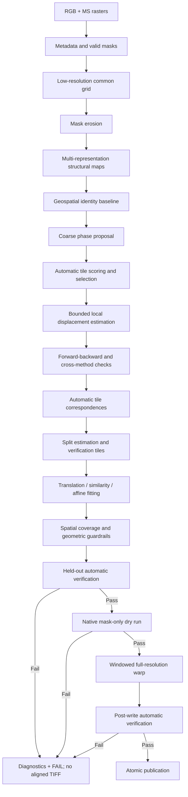

# AgriLift Automated Alignment V3

## Implementation Plan for Automated Cross-Spectral Registration at Batch Scale

**Status:** Implementation plan only.  
**Audience:** Junior and mid-level engineers implementing the next registration engine.  
**Operating target:** Hundreds of RGB/MS image pairs with no manually supplied coordinates during normal execution.  
**Supersedes:** Any earlier requirement that manual QGIS control points are necessary runtime inputs.

---

## 1. Objective

Build an automatic alignment engine that:

1. Uses existing georeferencing as a spatial prior.
2. Creates cross-spectral structural representations automatically.
3. Generates automatic control points through bounded local tile registration.
4. Fits the simplest transformation supported by distributed evidence.
5. Proves on untouched tiles that the candidate improves over the unaligned input.
6. Publishes an aligned raster only after geometric and output QA pass.
7. Processes full-resolution rasters with bounded memory.
8. Fails safely for genuinely ambiguous pairs without producing a misleading aligned product.

Manual QGIS control points are optional audit data for a representative development sample. They are never required to align each production pair.

---

## 2. Why the Existing Automatic Matcher Is Insufficient

Global SIFT on agricultural imagery is unreliable because:

- Crop rows repeat across large regions.
- RGB and multispectral reflectance intensities differ.
- The useful landmarks occupy only part of the survey.
- Many descriptors appear locally valid but correspond to the wrong row or field.
- One global detector ignores the strong existing geospatial prior.

The solution is not to request manual points. The engine must automatically create spatially distributed correspondences by matching bounded local structural patches.

---

## 3. Non-Negotiable Rules

1. The canonical transformation direction is always MS source pixel to RGB reference pixel.
2. The warp backend alone handles inverse pull-sampling semantics.
3. Phase correlation produces a coarse proposal only.
4. A phase-only result can never publish an aligned TIFF.
5. Feature extraction never uses invalid/alpha/NoData boundaries.
6. Estimation tiles and verification tiles are disjoint.
7. A candidate must improve over identity on untouched tiles.
8. Automatic evidence must cover at least three quadrants and 40% of the common valid ROI by default.
9. The simplest adequate model is preferred: translation, then similarity, then affine.
10. Homography is disabled by default.
11. Failure publishes diagnostics and an error code, not an aligned raster.
12. Full-resolution spectral warping starts only after automatic geometric QA passes.

---

## 4. Target Architecture



---

## 5. Data and Coordinate Contracts

### 5.1 Named coordinate spaces

All point collections must identify one of:

- `MS_SOURCE_PIXEL`
- `RGB_SOURCE_PIXEL`
- `REGISTRATION_GRID_PIXEL`
- `RGB_OUTPUT_PIXEL`
- `PROJECTED_MAP_COORDINATE`

Unlabeled point arrays must not cross module boundaries.

### 5.2 Canonical transformation

The authoritative forward relation is:

```text
p_rgb = T_ms_to_rgb × p_ms
```

The inverse relation used for pull resampling is:

```text
p_ms = inverse(T_ms_to_rgb) × p_rgb
```

Store both with explicit names:

- `forward_ms_to_rgb`
- `inverse_rgb_to_ms`

### 5.3 Automatic correspondence

Each automatic control point must contain:

```text
ms_point
rgb_point
tile_id
quadrant
channel_pair
structural_representation
matching_method
forward_backward_error
peak_ratio
local_similarity
method_agreement_error
confidence
```

This metadata is required for filtering, debugging, and reports.

---

## 6. Proposed Package Structure

```text
agrilift_alignment/
├── config/
│   ├── schema.py
│   └── default_config.yaml
├── core/
│   ├── coordinates.py
│   ├── transforms.py
│   ├── results.py
│   └── errors.py
├── data/
│   ├── reader.py
│   ├── masking.py
│   ├── registration_grid.py
│   └── diagnostics.py
├── preprocessing/
│   ├── normalization.py
│   └── structural_maps.py
├── registration/
│   ├── coarse_phase.py
│   ├── tile_selector.py
│   ├── local_phase.py
│   ├── local_correlation.py
│   ├── ecc_refiner.py
│   ├── sift_support.py
│   ├── rift_adapter.py
│   └── model_estimator.py
├── validation/
│   ├── correspondence_filter.py
│   ├── spatial_coverage.py
│   ├── held_out_qa.py
│   ├── footprint.py
│   └── post_write.py
├── output/
│   ├── rasterio_backend.py
│   └── publisher.py
├── pipeline/
│   └── orchestrator.py
└── tests/
```

Do not perform a large directory move before contracts and tests exist. Implement this structure incrementally while keeping the package runnable after every pull request.

---

## 7. Phase-by-Phase Implementation

## Phase 0 — Remove manual coordinates from the runtime contract

### Implementation

1. Ensure the public API accepts only raster paths and configuration.
2. Remove any runtime state that blocks processing because QGIS points are missing.
3. Keep optional audit points in a separate offline evaluation utility.
4. Mark previous incorrect outputs as invalid regression artifacts.

### Tests

- A batch job can enqueue 100 pairs without coordinate files.
- The engine never attempts to read a GCP file unless offline audit mode is explicitly selected.
- Missing audit data cannot affect production execution.

### Exit condition

Production alignment has no manual-input dependency.

## Phase 1 — Direction and backend correctness

This phase remains mandatory because a wrong-direction transform previously worsened alignment.

### Implementation

1. Retain a canonical forward `MS_TO_RGB` transform object.
2. Add a backend adapter for Rasterio/OpenCV semantics.
3. Explicitly convert OpenCV phase displacement into the corrective forward transformation.
4. Prevent callers from passing raw matrices directly to output functions.

### Required tests

- MS displaced left must move right toward RGB.
- MS displaced right must move left.
- Positive and negative vertical displacement.
- Mixed-sign displacement.
- Rotation and scale.
- Forward/inverse round trip.
- Low-resolution-to-native transform conversion.
- Rasterio and OpenCV backends produce equivalent landmark positions.
- Applying the inverse twice must fail a known-landmark assertion.

### Exit condition

Every backend demonstrably reduces landmark error for all direction cases.

## Phase 2 — Cached validity masks and registration grid

### Implementation

1. Read dataset mask, alpha, per-band mask, nodata, and finiteness once per raster.
2. Exclude invalid `2^32` fill values through formal validity masks.
3. Construct a common geospatial registration grid with a configurable maximum side, initially 3072 pixels.
4. Reproject only required registration bands and masks.
5. Preserve the native output-grid definition for later export.

### Tests

- Alpha-invalid `2^32` values never affect arrays or statistics.
- Masks use nearest-neighbour interpolation.
- Registration-grid dimensions remain bounded.
- Source masks are not repeatedly read per band.
- Empty or insufficient overlap fails safely.

## Phase 3 — Boundary-safe structural representations

### Implementation

1. Erode valid masks using an explicit registration-pixel radius, initially 8 pixels.
2. Fill/exclude invalid pixels before filtering so boundary values cannot bleed into gradients.
3. Produce structural representations:
   - Sobel magnitude
   - Gradient orientation representation
   - Laplacian or LoG response
   - Canny edges
4. Calculate representations for Green-to-Green and Red-to-Red.
5. Add optional phase congruency behind a feature flag.
6. Save bounded diagnostic thumbnails.

### Tile-safe gradient rule

```text
formal valid mask
→ safe invalid fill
→ eroded mask
→ valid-only normalization
→ structural filtering
→ zero outside eroded mask
```

### Tests

- No structural edge appears at the raster footprint.
- Internal roads and field boundaries remain visible.
- Constant imagery produces insufficient-texture failure.
- Erosion radius has unambiguous pixel behavior.
- Valid pixels remain unchanged by invalid sentinel magnitude.

## Phase 4 — Coarse proposal and uncertainty window

### Implementation

1. Run global phase correlation on eroded structural maps, never masks alone.
2. Bound translation through the existing geospatial prior.
3. Convert phase displacement into a forward corrective proposal.
4. Calculate peak response and secondary-peak/uncertainty information where possible.
5. Check that the proposal improves structural similarity over identity.
6. Return a proposal and search radius; never return an accepted alignment.

### Proposal result

```text
dx, dy
response
uncertainty_radius
channel_pair
representation
identity_similarity
proposal_similarity
```

### Tests

- Direction correctness for all signs.
- Low-response rejection.
- Excessive displacement rejection.
- Proposal that lowers similarity is rejected.
- Identical masks with unrelated imagery cannot pass based on mask shape.

### Fallback

If phase is weak, use the geospatial identity as the search centre with a larger configured radius. If no bounded search is defensible, fail with `ERR_COARSE_PROPOSAL_FAILED`.

## Phase 5 — Automatic tile selection

### Implementation

1. Partition the common ROI into a `5 × 5` grid initially.
2. Allow overlapping tiles so important features near cell boundaries are not lost.
3. Calculate per-tile:
   - valid fraction
   - gradient energy
   - entropy
   - corner/junction count
   - structure-tensor eigenvalue ratio
   - repetitive-pattern score
4. Reject blank, invalid, and highly repetitive tiles.
5. Rank remaining tiles while enforcing geographic distribution.
6. Reserve entire tiles for verification before any model fitting.

### Repetitive-pattern detection

Tiles dominated by one orientation, such as parallel crop rows, should receive a lower score. Use structure-tensor anisotropy and autocorrelation peak repetition as signals.

### Tests

- Blank tile rejection.
- NoData tile rejection.
- Repetitive crop-row penalty.
- Road intersection receives higher score than uniform rows.
- Selected tiles span at least three quadrants when sufficient data exists.
- Verification tiles never appear in estimation input.

## Phase 6 — Bounded local displacement engine

This phase is the main algorithmic-gap solution.

### Implementation per selected tile

1. Treat the RGB tile as the reference template.
2. Predict its MS location using georeferencing plus coarse proposal.
3. Extract an MS search window bounded by the uncertainty radius.
4. Estimate displacement using gradient normalized cross-correlation.
5. Estimate a second displacement using local phase correlation.
6. Refine the strongest valid proposal using ECC.
7. Perform the same search in reverse from MS to RGB.
8. Calculate forward-backward round-trip error.
9. Require agreement between at least two methods or channel/representation combinations.
10. Convert the accepted tile-centre displacement into an automatic correspondence.

### Required local confidence gates

- Minimum valid fraction.
- Minimum normalized correlation/ECC score.
- Minimum primary-to-secondary peak ratio.
- Maximum forward-backward error.
- Maximum method-agreement error.
- Displacement remains inside coarse search bounds.

### Recommended initial thresholds

```yaml
minimum_tile_valid_fraction: 0.75
minimum_peak_ratio: 1.20
maximum_forward_backward_error_px: 0.75
maximum_method_agreement_error_px: 1.0
minimum_ecc_correlation: 0.70
```

Defaults require empirical tuning, but every threshold must be typed and tested.

### Tests

- Known subpixel translations.
- Search boundary behavior.
- Incorrect periodic peak rejection.
- Forward match succeeds but reverse match fails.
- ECC non-convergence.
- Method disagreement.
- Correct coordinate conversion after local crop offsets.
- Tile centre correspondence reflects the forward MS-to-RGB direction.

### Fallback cascade

```text
Green Sobel: NCC + local phase + ECC
→ Red Sobel: NCC + local phase + ECC
→ Green LoG/orientation maps
→ Red LoG/orientation maps
→ structural SIFT support
→ optional RIFT adapter
→ reject tile
```

Rejecting one tile does not fail the image pair. The pair fails only when insufficient distributed evidence remains.

## Phase 7 — RIFT/multimodal fallback adapter

### When to implement

Implement after the bounded NCC/phase/ECC engine is benchmarked. Do not introduce RIFT merely because a single pair fails.

### Requirements

1. RIFT produces the same automatic correspondence contract as other matchers.
2. It uses eroded valid masks.
3. Matches remain bounded by the geospatial/coarse search window.
4. It cannot bypass forward-backward, spatial, RANSAC, or held-out QA.
5. Dependency, runtime, licensing, and packaging must be reviewed.

### Tests

- Synthetic cross-radiometric inversion.
- Rotation and scale changes.
- Invalid-boundary exclusion.
- Spatially clustered RIFT matches still fail coverage.

## Phase 8 — Correspondence filtering and model hierarchy

### Implementation

1. Remove tile candidates failing confidence gates.
2. Cluster displacement vectors and reject isolated modes.
3. Fit models in order:
   - translation
   - similarity
   - affine
4. Use RANSAC/MAGSAC.
5. Select the simplest model passing all validation.
6. Keep homography disabled unless a future reviewed requirement enables it.

### Spatial coverage formula

```text
coverage = Area(ConvexHull(inliers) ∩ CommonValidROI)
           / Area(CommonValidROI)
```

Default minimum: 40%.

Also require:

- At least three represented quadrants.
- Minimum number of occupied grid cells.
- Minimum 15 inliers; 20–30 preferred for affine.
- Plausible translation, rotation, scale, shear, determinant, and condition number.

### Model promotion

Do not choose affine merely because it has lower training error. It must provide meaningful held-out improvement over translation/similarity without violating complexity guardrails.

### Tests

- One displacement cluster plus outliers.
- Two competing periodic modes.
- Collinear correspondences.
- High match count with poor spatial coverage.
- Simpler model preferred when held-out results are equivalent.
- Affine rejected for excessive shear/scale.

## Phase 9 — Independent automatic verification

### Implementation

Use whole tiles reserved before fitting.

For each verification tile:

1. Predict its MS location with the selected transform.
2. Use a different representation or method from estimation where possible.
3. Search only a small residual window.
4. Calculate remaining displacement.
5. Compare candidate residual against identity and coarse-proposal residuals.

Example independence:

```text
Estimate: Green Sobel local phase + ECC
Verify: Red LoG normalized correlation
```

### Required metrics

- RMSE in native RGB pixels.
- Median residual.
- 95th percentile.
- Maximum.
- Per-quadrant RMSE.
- Forward-backward verification error.
- Percentage improvement over identity.
- Percentage improvement over coarse proposal.

### Mandatory gates

- At least 8–12 valid verification tiles/points.
- Verification spans at least three quadrants when available.
- Candidate beats identity globally.
- Candidate does not worsen any required quadrant.
- Candidate beats the coarse proposal by a configured margin.
- Native-equivalent RMSE is below the release threshold.

A phase response, high NCC score, or good footprint can never override failure here.

### Tests

- Correct transform improves all held-out regions.
- Sign-reversed transform is worse than identity and fails.
- Central improvement with edge degradation fails.
- Training overfit fails verification.
- Same-method and cross-method verification are reported distinctly.

## Phase 10 — Native mask dry run and output streaming

### Implementation

1. Convert the verified registration transform to native coordinates through explicit scale matrices.
2. Check representative automatic points after conversion.
3. Warp only the native MS validity mask.
4. Recheck retention and overlap.
5. Write spectral data to a run-scoped staging TIFF using 512×512 tiles.
6. Use bilinear interpolation for reflectance and nearest-neighbour for masks.
7. Bound GDAL cache, warp memory, threads, and RSS.
8. Generate diagnostics from overviews, not full arrays.

### Resource configuration

```yaml
tile_width: 512
tile_height: 512
gdal_cache_max_mb: 256
warp_memory_limit_mb: 256
num_warp_threads: 1
peak_rss_target_mb: 1024
peak_rss_hard_limit_mb: 2048
```

### Tests

- Native direction and landmark position.
- Unequal X/Y registration scaling.
- Tile seams against a trusted small full-frame warp.
- Alpha and metadata preservation.
- Interrupted write cannot create a final-looking TIFF.
- Hard memory-budget behavior.

## Phase 11 — Post-write automatic QA and publication

### Implementation

1. Re-run residual searches on selected verification tiles from the written raster.
2. Confirm that native conversion and resampling preserved the accepted geometry.
3. Compare post-write metrics against pre-write and identity metrics.
4. Generate bounded diagnostics.
5. Atomically publish only on `PASS`.

### Outputs on PASS

- Aligned TIFF.
- Machine-readable report.
- Checkerboard and false-colour previews.
- Tile-selection map.
- Local displacement-vector map.
- Inlier and held-out residual visualizations.

### Outputs on FAIL

- Failure report.
- Diagnostic thumbnails.
- Candidate/rejection information.
- No `_aligned.tif`.

---

## 8. Batch Processing Behavior

For every pair, assign one outcome:

### PASS

All mandatory geometric, spatial, native-mask, memory, and post-write gates pass. Publish automatically.

### RETRY

The first strategy lacks evidence, but another configured automatic strategy remains:

- alternate channel
- alternate structural representation
- different tile size
- ECC refinement
- SIFT support
- RIFT fallback

Retry is an internal state, not a final published result.

### FAIL

No automatic candidate passes. Publish diagnostics only and add the pair to an exception queue.

For 100 image pairs, the batch summary must report:

- passed count
- failed count
- strategy distribution
- median/P95 runtime
- median/P95 memory
- residual distribution
- failure-code distribution

---

## 9. Required Diagnostics

Each run should produce bounded artifacts:

```text
01_valid_and_eroded_masks.png
02_structural_maps.png
03_coarse_proposal.png
04_tile_quality_scores.png
05_local_displacements.png
06_forward_backward_errors.png
07_method_agreement.png
08_ransac_inliers.png
09_spatial_coverage.png
10_held_out_residuals.png
11_final_checkerboard.png
12_final_false_color.png
alignment_report.json
```

Diagnostics must state whether the run stopped before output publication.

---

## 10. Pull Request Sequence

### PR 1 — Runtime contract and direction safety

Remove manual-coordinate dependencies; complete transform/backend tests.

### PR 2 — Masking and structural representations

Implement cached masks, erosion, Sobel/orientation/LoG/Canny, and diagnostics.

### PR 3 — Coarse proposal

Implement bounded, direction-correct phase proposal with identity-improvement check.

### PR 4 — Tile selector

Implement texture, entropy, structure-tensor, repetition, and spatial-distribution scoring.

### PR 5 — Local NCC and phase displacement

Implement bounded automatic tile correspondences and confidence measures.

### PR 6 — ECC and forward-backward verification

Implement subpixel refinement, round-trip checks, and method agreement.

### PR 7 — Model hierarchy and spatial coverage

Implement correspondence clustering, translation/similarity/affine fitting, and 40% ROI coverage.

### PR 8 — Held-out automatic QA

Implement cross-method verification and identity/coarse improvement gates.

### PR 9 — Optional RIFT adapter

Implement only if benchmark evidence justifies it.

### PR 10 — Native streaming and publication

Implement native-mask dry run, memory-bounded output, post-write QA, and atomic publication.

### PR 11 — Batch benchmark and threshold tuning

Run representative image sets and produce acceptance evidence.

Every PR includes unit tests, integration tests, diagnostic examples, and updated configuration documentation.

---

## 11. Definition of Done

The automatic engine is complete only when:

1. No production pair requires manually supplied coordinates.
2. Direction tests pass for every backend and displacement sign.
3. Invalid pixels and footprint edges cannot influence matching.
4. Local automatic correspondences are spatially distributed.
5. Forward-backward and method-agreement gates reject periodic false matches.
6. The selected model covers at least 40% of the common valid ROI by default.
7. Verification tiles were never used for fitting.
8. The candidate beats identity and coarse alignment on untouched regions.
9. No required quadrant becomes worse.
10. Phase-only candidates cannot publish.
11. Full-resolution processing remains below the 2 GB hard RSS ceiling.
12. Post-write automatic QA agrees with pre-write geometry.
13. Failed pairs publish no aligned TIFF.
14. Batch reporting identifies every failure reason.
15. A representative QGIS audit confirms that automatic numeric QA correlates with actual visual/geometric improvement.

The QGIS audit in item 15 is a release audit on a representative sample, not a per-image runtime input.

