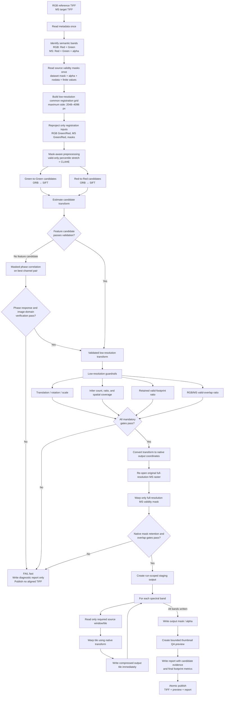
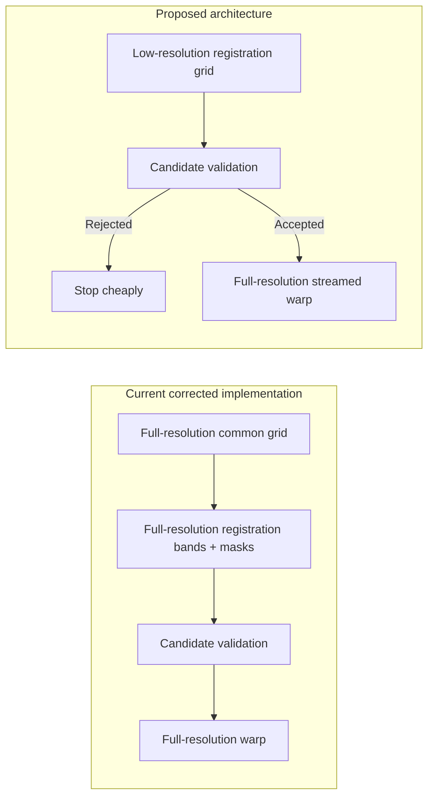

# Drone Alignment: Proposed Production Data Flow

**Purpose:** Decision diagram for review before the next performance-focused implementation phase.  
**Status:** Implemented and verified on the supplied RGB/MS pair on 2026-08-06.

## Executive Summary

The proposed design moves full-resolution spectral reprojection and warping **after** low-resolution registration and validation. This prevents expensive processing of the complete multispectral orthomosaic when no transform can be verified.



## Current Versus Proposed Cost Boundary



## Native-Coordinate Transform Rule

The registration matrix estimated in the low-resolution grid must not be copied directly into native-resolution warping.

```text
M_native = S_destination^-1 × M_low_resolution × S_source
```

Where `S_source` and `S_destination` map native pixel coordinates into their corresponding registration-grid coordinates. If both images use the same downsampled common target grid, the conversion simplifies; translation still must be scaled correctly, while rotation, shear, and scale must retain their geometric meaning.

## Mandatory Publication Gates

| Gate | Purpose | Failure result |
|---|---|---|
| Valid mask available | Exclude alpha-invalid/fill pixels | `INSUFFICIENT_VALID_DATA` |
| Registration candidate evidence | Prevent arbitrary transforms | Try next candidate or `FAIL` |
| Translation / rotation / scale | Reject implausible geometry | `TRANSFORM_OUT_OF_BOUNDS` |
| Feature spatial coverage or phase response | Reject weak evidence | `INSUFFICIENT_MATCHES` / `LOW_PHASE_RESPONSE` |
| Low-resolution footprint retention and overlap | Reject obvious clipping cheaply | `FOOTPRINT_RETENTION_FAILED` |
| Native-resolution mask confirmation | Confirm the winning transform at export scale | `FOOTPRINT_RETENTION_FAILED` |
| Output tile completion and mask write | Prevent partial/corrupt data | `OUTPUT_WRITE_FAILED` |
| Atomic publication | Ensure final names represent complete products | No final publication on error |

## Why This Is the Recommended Architecture

- Most registrations can be accepted or rejected from 2048–4096 px inputs rather than full orthomosaics.
- A failed candidate avoids full-resolution spectral reprojection and output work.
- Validity masks are read once and reused rather than repeatedly rebuilt per band.
- The full-resolution stage streams tiles, so peak memory is bounded by tile size rather than total mosaic size.
- A final native-mask check preserves the strict clipping and overlap safeguards established during registration.
- Partial output remains staged until every validation and write step has completed.

## Implementation Status

| Capability | Status |
|---|---|
| Alpha/dataset-mask-aware normalization | Implemented |
| Green/red candidate registration and CLAHE | Implemented |
| Transform, phase-response, and footprint guardrails | Implemented |
| Band-at-a-time staged output | Implemented |
| Low-resolution-only registration grid | Implemented |
| Source mask cache | Implemented |
| Native-coordinate transform conversion | Implemented |
| Tile/window streaming from source raster | Implemented |
| Native-resolution final mask confirmation | Implemented |

## Controlled Verification Result

The optimized pipeline was run against the supplied orthomosaics and published its result to `Stuff/aligned_v3/`.

| Metric | Result |
|---|---|
| Registration method | Masked phase correlation, Green/Green |
| Native residual translation | `(-1.19 px, -0.19 px)` / `(-9.0 cm, -1.4 cm)` |
| Phase response | `0.801` |
| Retained MS valid footprint | `99.9986%` |
| RGB-reference overlap | `92.83%` |
| Output valid-mask coverage | `91.84%` |
| Final TIFF | `502.03 MiB` |
| QA preview | `17.06 MiB` |
| Run time | approximately 3m51s |

The candidate was accepted through phase response and masked image-domain verification. Feature candidates were rejected by held-out residual QA. A QGIS visual review remains a release gate because no independent feature-correspondence residual was available for the selected phase result.
