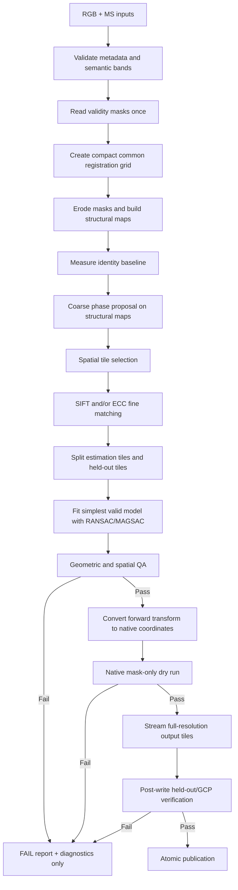

# AgriLift Drone Alignment V2

## Junior Engineering Implementation Plan and Architecture Rulebook

**Status:** Approved implementation plan only; no implementation is contained in this document.  
**Audience:** Junior software engineers working without continuous senior supervision, reviewers, and QA staff.  
**Supersedes:** Earlier alignment remediation plans wherever they conflict with this document.  
**Primary goal:** Produce an MS-to-RGB alignment only when geographically distributed, independent geometric evidence proves that the result is better than the unaligned input.

---

## 1. Incident Summary and Required Mindset

The previous pipeline produced an output that QGIS proved was farther from the RGB reference than the unaligned MS raster. The selected method was Green-to-Green phase correlation. It returned a small displacement, and the pipeline applied that displacement in the wrong corrective direction. Correlation and footprint metrics still looked strong because a small incorrect shift barely changes global similarity or raster coverage.

The previous result is invalid. Its `PASS` status must not be used as acceptance evidence.

The V2 engine must satisfy this rule:

> No aligned raster may be published unless independent, spatially distributed geometric checkpoints prove that the selected transform reduces error relative to the original unaligned raster.

Correlation is a proposal mechanism. It is not geometric proof.

---

## 2. Non-Negotiable System Invariants

1. The canonical forward transform is always `MS source pixel → RGB reference pixel`.
2. Resampling uses the inverse mapping only through a documented backend adapter.
3. Phase correlation may initialize a search but can never publish an alignment.
4. Invalid pixels are determined from masks/alpha/nodata, never from `pixel != 0` alone.
5. Raster-footprint boundaries are excluded from structural feature extraction.
6. Model estimation and final verification use spatially separated evidence.
7. A candidate must beat the identity/unaligned baseline by a configured margin.
8. A candidate with insufficient spatial coverage fails, regardless of match count.
9. Failure publishes diagnostics and an error code, not an `_aligned.tif` file.
10. Full-resolution spectral processing begins only after low-resolution geometric QA passes.
11. Peak resident memory must remain below 2 GB; the engineering target is below 1 GB.
12. Only `PASS` may publish during the first V2 release.

---

## 3. Proposed Package Architecture

```text
agrilift_alignment/
├── config/
│   ├── default_config.yaml
│   └── schema.py
├── core/
│   ├── coordinates.py          # Named coordinate spaces and point conversion
│   ├── transforms.py           # Forward/inverse transform value objects
│   ├── errors.py               # Typed error codes
│   └── results.py              # Candidate/run/status contracts
├── data/
│   ├── io.py                   # Metadata and windowed raster access
│   ├── masking.py              # Dataset/alpha/nodata masks and erosion
│   ├── registration_grid.py    # Low-resolution common grid
│   └── visualizer.py           # Bounded diagnostic products
├── preprocessing/
│   ├── normalizer.py           # Valid-only radiometric scaling and CLAHE
│   └── feature_maps.py         # Sobel, Canny, optional phase congruency
├── registration/
│   ├── coarse/
│   │   └── phase_correlation.py
│   ├── fine/
│   │   ├── base.py
│   │   ├── sift_matcher.py
│   │   └── ecc_matcher.py
│   └── transformation.py       # Translation/similarity/affine/homography hierarchy
├── validation/
│   ├── spatial_grid.py
│   ├── footprint.py
│   ├── residual_qa.py
│   └── baseline.py
├── output/
│   ├── warp_backend.py         # API-specific inverse mapping
│   └── publisher.py            # Staging and atomic publication
├── pipeline/
│   └── orchestrator.py
├── tests/
└── main.py
```

The folder structure is guidance, not a reason to rewrite working I/O unnecessarily. Contracts and tests come before moving files. Each pull request must remain runnable.

---

## 4. End-to-End Execution Flow



---

## 5. Core Contracts to Implement First

### 5.1 Coordinate spaces

Define explicit enum/value types:

- `MS_SOURCE_PIXEL`
- `RGB_SOURCE_PIXEL`
- `REGISTRATION_GRID_PIXEL`
- `RGB_OUTPUT_PIXEL`
- `PROJECTED_MAP_COORDINATE`

Every point collection and transform must state its coordinate space. Passing an unlabeled NumPy point array across modules is prohibited.

### 5.2 Transform contract

The only canonical stored transform is:

```text
p_rgb = T_ms_to_rgb × p_ms
```

The derived inverse is:

```text
p_ms = inverse(T_ms_to_rgb) × p_rgb
```

Use distinct fields:

- `forward_ms_to_rgb`
- `inverse_rgb_to_ms`

Never use a generic field named only `matrix` in a public module contract.

### 5.3 Warp backend contract

Raster resampling performs backward/pull sampling. The output backend is responsible for adapting the canonical forward transform to its library.

Important API distinction:

- Rasterio/custom pull mapping generally requires `inverse_rgb_to_ms`.
- OpenCV `warpAffine` normally accepts a forward matrix and internally inverts it unless `WARP_INVERSE_MAP` is supplied.
- OpenCV `remap` receives explicit destination-to-source coordinates.

Callers must never pre-invert a matrix based on guesswork. Backend tests must prove landmark movement.

### 5.4 Result contracts

Required statuses:

- `PASS`
- `WARNING`
- `FAIL`
- `UNVERIFIED`

V2 publication rule: only `PASS` publishes.

Required error codes include:

- `ERR_INPUT_INVALID`
- `ERR_INSUFFICIENT_VALID_DATA`
- `ERR_INSUFFICIENT_TEXTURE`
- `ERR_COARSE_PROPOSAL_FAILED`
- `ERR_INSUFFICIENT_MATCHES`
- `ERR_SPATIAL_COVERAGE_FAILED`
- `ERR_TRANSFORM_OUT_OF_BOUNDS`
- `ERR_GEOMETRIC_QA_FAILED`
- `ERR_NO_BASELINE_IMPROVEMENT`
- `ERR_NATIVE_MASK_QA_FAILED`
- `ERR_MEMORY_BUDGET_EXCEEDED`
- `ERR_OUTPUT_WRITE_FAILED`

---

## 6. Phase-by-Phase Implementation

## Phase 0 — Freeze the failed baseline

### Work

1. Mark all prior phase-only outputs as invalid test artifacts.
2. Preserve the QGIS screenshot and the three-point ordering as regression evidence.
3. Record the old reported transform and its incorrect movement.
4. Ensure operational documentation does not call the old output successful.

### Tests

- A regression test must represent: aligned result moved farther from the reference than identity.
- Acceptance logic must reject any candidate whose residual is worse than identity.

### Exit gate

The known bad transform cannot receive `PASS` in the new validation layer.

## Phase 1 — Ground-truth dataset and transform-direction harness

This phase blocks every algorithm phase after it.

### Work

1. In QGIS, collect 12–20 high-confidence RGB/MS correspondences across centre and all quadrants.
2. Prefer roads, field corners, irrigation intersections, structures, and non-repetitive landmarks.
3. Store point ID, RGB/MS pixel coordinates, projected coordinates, quadrant, confidence, and description.
4. Calculate identity/unaligned residuals in native RGB pixels and metres.
5. Write the coordinate and transform contracts from Section 5 into module docstrings and developer documentation.

### Mandatory synthetic tests

- Positive X translation.
- Negative X translation.
- Positive Y translation.
- Negative Y translation.
- Mixed-sign translation.
- Small rotation and scale.
- Alpha-masked image with `2^32` invalid fill.
- Asymmetric pattern that cannot pass after a 180-degree or sign reversal.

Each test must assert:

```text
distance(warped_landmark, reference_landmark)
< distance(unaligned_landmark, reference_landmark)
```

Also verify:

- Forward/inverse round trip returns the original point.
- Low-resolution-to-native conjugation preserves physical movement.
- Each warp backend moves a landmark in the expected direction.
- Phase relative shift is explicitly converted into the corrective MS-to-RGB direction.

### Exit gate

No algorithm work proceeds until all direction tests pass and a reviewer signs the canonical transform contract.

## Phase 2 — Configuration and typed interfaces

### Work

Create Pydantic configuration groups for:

- Registration-grid maximum dimension.
- Green/red channel priority.
- Normalization percentiles and CLAHE.
- Structural feature-map method.
- Mask erosion radius.
- Coarse translation bound and phase response.
- Tile grid dimensions and texture threshold.
- SIFT/ECC parameters.
- Model hierarchy and RANSAC/MAGSAC.
- Inlier, hold-out, spatial coverage, and residual thresholds.
- Footprint retention and overlap.
- Tile dimensions, GDAL cache, warp memory, threads, and RSS ceiling.

### Required defaults

```yaml
registration_grid_max_dimension: 3072
mask_erosion_radius_px: 8
inlier_hull_coverage_min: 0.40
minimum_quadrants: 3
tile_width: 512
tile_height: 512
gdal_cache_max_mb: 256
warp_memory_limit_mb: 256
num_warp_threads: 1
peak_rss_hard_limit_mb: 2048
peak_rss_target_mb: 1024
```

The erosion setting is a radius, not an ambiguous kernel size. A radius of 8 corresponds approximately to a `17 × 17` structuring element.

### Tests

- Every threshold boundary.
- Low percentile must be below high percentile.
- Alpha cannot be selected as a spectral channel.
- Invalid tile and memory settings fail before reading imagery.

## Phase 3 — Masking and structural preprocessing

### Work

1. Read dataset, alpha, per-band mask, nodata, and finiteness validity once per source.
2. Combine them deterministically.
3. Build the compact common registration grid.
4. Erode the valid masks using a distance transform or binary erosion.
5. Ensure invalid fill cannot bleed into gradients.
6. Calculate valid-only percentile normalization and optional CLAHE.
7. Build Sobel gradient magnitude as the first default representation.
8. Support Canny as a configured alternative; phase congruency remains optional until benchmarked.
9. Zero feature-map pixels outside the eroded mask.

Preferred ordering:

```text
Mask invalid values → safe fill/interpolation → erode mask
→ normalize valid data → structural filter → apply eroded mask
```

### Diagnostics

- Original channels.
- Valid and eroded masks.
- RGB/MS Sobel maps.
- Canny maps when enabled.
- Common valid ROI.

### Tests

- `2^32` fill does not affect normalization.
- No high gradient remains at the alpha/NoData boundary.
- Genuine internal field edges remain after erosion.
- Mask erosion uses registration pixels and reports physical distance.
- Empty or low-texture imagery fails safely.

### Exit gate

A reviewer can see roads/field boundaries in both structural maps without the raster frame dominating.

## Phase 4 — Coarse phase proposal

### Work

1. Run phase correlation on structural feature maps, not masks.
2. Use the eroded common mask only to restrict valid correlation support.
3. Bound displacement using geospatial metadata and configured maximum movement.
4. Return a proposal containing displacement, response, uncertainty/search radius, channel, and coordinate spaces.
5. Convert the library’s relative displacement into the corrective forward MS-to-RGB proposal.
6. Verify that the proposal improves structural similarity over identity.

### Forbidden behavior

- Phase output cannot become the selected final transform.
- High phase response cannot override geometric QA.
- Mask/frame correlation cannot be treated as imagery correlation.

### Tests

- Known shifts in all signs.
- Low response rejection.
- Excessive translation rejection.
- Same footprint but unrelated internal imagery must not pass.
- Applying the proposal must move known points toward the reference.

### Fallback

If phase fails, fine matching may use the geospatial identity prior with the configured maximum search radius. If no bounded search is defensible, return `ERR_COARSE_PROPOSAL_FAILED`.

## Phase 5 — Spatial grid and local fine matching

### Work

1. Partition the common valid ROI into a configurable `4 × 4` or `5 × 5` grid.
2. Score each tile for valid fraction, gradient energy, entropy, and repetitive-pattern risk.
3. Reject blank/weak tiles.
4. Use the coarse proposal to constrain local search.
5. Run SIFT on structural maps using bidirectional mutual-nearest matching, Lowe ratio, absolute distance, and displacement consistency.
6. Run ECC only as an initialized local refinement. ECC is not a keypoint matcher; convert accepted patch displacement into explicit correspondence evidence.
7. Attach tile, quadrant, channel, method, confidence, and coordinate space to every correspondence.

### Spatial evidence rules

- Do not let one road, field, or corner dominate.
- Separate estimation tiles from verification tiles before fitting.
- Do not randomly split points from the same tile into both sets.

### Tests

- Good distributed features.
- Matches clustered in one tile.
- Repetitive crop rows.
- Blank tiles.
- One quadrant missing.
- Correct local motion around a coarse proposal.
- ECC non-convergence and low-correlation rejection.

### Fallback order

```text
Green Sobel + SIFT
→ Red Sobel + SIFT
→ Green Sobel + ECC refinement
→ Red Sobel + ECC refinement
→ FAIL
```

No phase-only fallback is permitted.

## Phase 6 — Hierarchical model estimation

### Work

Fit models from simplest to most complex:

1. Translation.
2. Similarity.
3. Affine.
4. Homography only when explicitly enabled.

Use RANSAC/MAGSAC and evaluate:

- Inlier count and ratio.
- Determinant and condition number.
- Translation, rotation, scale, and shear.
- Spatial distribution.
- Model improvement over the simpler model.

Homography additionally requires local Jacobian checks across the ROI to prevent edge folding or extreme local scale.

### Coverage formula

Use:

```text
coverage = Area(ConvexHull(inliers) ∩ CommonValidROI)
           / Area(CommonValidROI)
```

Default minimum: `0.40`.

Also require at least three quadrants and a configured number of occupied grid cells. Convex hull alone can bridge invalid holes and must not be the only coverage measurement.

### Tests

- Clustered inliers fail despite high count.
- Large hull outside a concave ROI is clipped correctly.
- Affine wins only when similarity is insufficient.
- Homography distortion guardrails.
- Degenerate/collinear correspondences.

## Phase 7 — Independent geometric QA

### Work

Apply the selected model to held-out tiles/keypoints never used for estimation.

Calculate in native RGB-reference pixels and metres:

- RMSE.
- Median residual.
- 95th percentile.
- Maximum.
- Per-quadrant RMSE.
- Residual-vector direction patterns.

### Mandatory acceptance conditions

- At least 15 RANSAC inliers; 20–30 recommended for affine/homography.
- At least 8–12 held-out verification points.
- Minimum three quadrants; four preferred.
- Inlier hull/ROI coverage at least 40% by default.
- Held-out evidence must also be spatially distributed.
- Final residual below absolute native-pixel and physical thresholds.
- No quadrant exceeds its threshold.
- Final model improves over identity by a configured absolute and percentage margin.
- Final model improves over the coarse proposal.

The exact `RMSE < 1 px` rule must mean one native RGB-reference pixel, not one downsampled registration pixel.

### Failure behavior

Any mandatory failure produces `ERR_GEOMETRIC_QA_FAILED` or the more specific error. Phase response cannot override it.

Identity may be recorded as a diagnostic baseline but must not be published as aligned output.

## Phase 8 — Native mask dry run and footprint QA

### Work

1. Convert the verified registration transform to native output coordinates using explicit source/destination scale matrices.
2. Verify conversion using held-out points.
3. Warp only the native MS validity mask using the output backend.
4. Compute retained source fraction, reference overlap, target overlap, overlap coefficient, and IoU.
5. Reject clipping or unexpected footprint movement.

### Tests

- Identity footprint.
- Correct positive/negative translations.
- Sign-reversed transform must fail baseline improvement or point-direction checks.
- Large clipping.
- Irregular alpha footprints.
- Registration-to-native conversion with unequal X/Y scale factors.

## Phase 9 — Full-resolution streaming output

### Work

1. Create a run-scoped staging TIFF only after all geometric and native-mask gates pass.
2. Use `512 × 512` windows by default; permit `1024 × 1024` after benchmarks.
3. Read only the source data required for each destination window.
4. Use bilinear interpolation for spectral reflectance and nearest-neighbour for masks/alpha.
5. Preserve CRS, output transform, GSD, band descriptions, metadata, and mask semantics.
6. Bound GDAL cache, warp memory, and threads.
7. Sample process RSS during execution.
8. Stop safely with `ERR_MEMORY_BUDGET_EXCEEDED` before exceeding the hard budget when practical.
9. Generate previews from bounded overviews, never full-resolution arrays.
10. Publish atomically only after post-write verification.

### Memory rules

- Hard RSS ceiling: 2 GB.
- Engineering target: below 1 GB.
- No full spectral cube.
- No full warped cube.
- No full preview array.
- At most the configured small number of active tiles.

### Tests

- Tile seam equivalence against a small trusted full-frame warp.
- Correct forward/inverse behavior for each backend.
- Metadata and mask preservation.
- Interrupted staging write leaves no final-looking product.
- Memory benchmark on the supplied real MS raster.

## Phase 10 — Post-write QA and publication

### Work

1. Re-evaluate manual GCPs/held-out points against the written raster.
2. Confirm that writing and coordinate conversion did not reverse or alter the accepted model.
3. Generate checkerboard, false-colour, match, and residual-vector diagnostics.
4. Compare final error with the original unaligned baseline.
5. Atomically rename staging files only when every gate passes.

### Required diagnostics

```text
01_input_masks.png
02_eroded_masks.png
03_green_structural_maps.png
04_red_structural_maps.png
05_coarse_proposal.png
06_tile_quality.png
07_candidate_matches.png
08_ransac_inliers.png
09_held_out_residual_vectors.png
10_final_checkerboard.png
11_final_false_color.png
alignment_report.json
```

### Report requirements

- Forward and inverse transforms with named coordinate spaces.
- Phase proposal and explicit statement that it was not final evidence.
- Identity baseline metrics.
- Coarse metrics.
- Final held-out metrics.
- Improvement percentage.
- Per-quadrant results.
- Hull and grid coverage.
- Rejected candidates and reasons.
- Peak RSS and output sizes.
- Final publication decision.

---

## 7. Pipeline State Machine and Fallback Policy

```text
CREATED
→ INPUTS_VALIDATED
→ STRUCTURAL_MAPS_READY
→ BASELINE_MEASURED
→ COARSE_PROPOSED
→ FINE_MATCHES_COLLECTED
→ MODEL_ESTIMATED
→ GEOMETRIC_QA_PASSED
→ NATIVE_MASK_QA_PASSED
→ OUTPUT_STAGED
→ POST_WRITE_QA_PASSED
→ PUBLISHED
```

Any state may transition to `FAILED` with a typed reason.

Expected algorithm failures may try the next configured channel/matcher/model. Programming errors, coordinate-space mismatches, shape mismatches, and unexpected I/O errors must stop immediately; they must not silently trigger another algorithm.

Final fallback:

```text
No candidate passes
→ FAIL
→ diagnostics + report
→ no aligned raster
```

---

## 8. Pull Request Sequence for Junior Staff

### PR 1 — Ground truth and coordinate contracts

Deliver QGIS GCP data, transform-direction types, forward/inverse tests, and the failed-result regression.

### PR 2 — Configuration and result contracts

Deliver Pydantic models, error codes, statuses, and state definitions.

### PR 3 — Masking and structural maps

Deliver cached masks, erosion, Sobel/Canny maps, diagnostics, and boundary-artifact tests.

### PR 4 — Coarse proposal

Deliver bounded structural phase correlation, direction conversion, and proposal-only behavior.

### PR 5 — Tiled SIFT matcher

Deliver tile scoring, constrained SIFT, mutual matching, metadata-rich correspondences, and spatial tests.

### PR 6 — ECC refinement

Deliver initialized local ECC with convergence and confidence rejection.

### PR 7 — Model hierarchy and coverage

Deliver translation/similarity/affine selection, optional homography, ROI-intersected hull coverage, and distortion tests.

### PR 8 — Independent residual QA

Deliver tile-level hold-out, baseline-improvement gate, native-pixel/physical metrics, and per-quadrant QA.

### PR 9 — Native mask and streaming backend

Deliver transform conversion, backend-specific inverse handling, mask dry run, bounded tiles/cache/RSS, and metadata preservation.

### PR 10 — Publication and real-data acceptance

Deliver post-write checks, atomic publication, diagnostics, full report, QGIS validation, and benchmark evidence.

Each PR must include tests. Do not combine PRs to “save time.” Review correctness at each boundary.

---

## 9. Definition of Done

V2 is complete only when:

1. The known wrong-direction result fails regression testing.
2. Forward and inverse transform semantics are explicit and backend-tested.
3. Manual QGIS ground truth covers the full ROI.
4. Invalid values and raster-border gradients cannot influence matching.
5. Phase correlation is proposal-only.
6. Local structural matches are spatially distributed.
7. Hull/ROI coverage meets the configured threshold.
8. Held-out native-pixel residuals pass in all required quadrants.
9. The selected model demonstrably improves over identity and the coarse proposal.
10. Failure produces no aligned raster.
11. Native mask QA passes before spectral output.
12. Streaming remains below the 2 GB hard RSS limit.
13. Post-write point checks agree with pre-write geometry.
14. The full automated suite passes.
15. QGIS control-point and visual review confirms improvement.
16. A senior reviewer signs the transformation and QA report.

---

## 10. Junior Engineer Review Checklist

Before requesting review, answer every question:

- Which coordinate space does every point use?
- Is this transform forward MS-to-RGB or inverse RGB-to-MS?
- Does the chosen backend expect forward or backward mapping?
- Does an asymmetric landmark test prove movement direction?
- Were invalid-mask boundaries eroded before structural filtering?
- Was phase used only as a proposal?
- Were estimation and verification separated by tile?
- What fraction of the valid ROI does the inlier hull actually cover?
- Does the candidate improve over identity in every required region?
- Are residuals reported in native pixels and metres?
- Would failure publish an `_aligned.tif` file? The answer must be no.
- Did peak RSS remain within budget?
- Did QGIS confirm the numeric result?

If any answer is missing or ambiguous, the work is not ready to merge.

