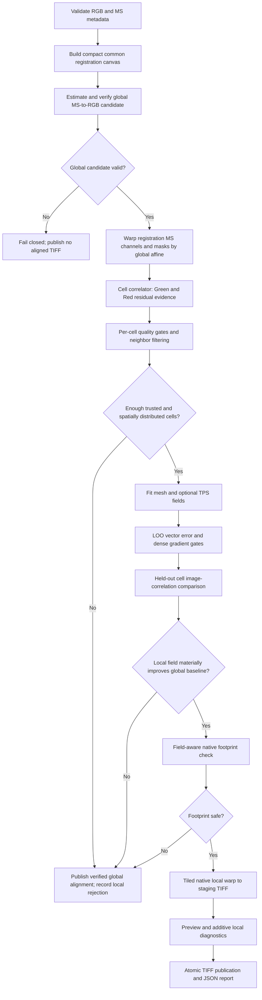

# Feature-Agnostic Local Correlation Alignment

## Implementation and Architecture Blueprint

**Audience:** Junior Python developers implementing the feature, reviewers, and QA engineers  
**Repository area:** `drone_alignment`  
**Status:** Implementation-ready design; no production code has been changed by this document  
**Primary goal:** Add a safe `local_correlation` mode that corrects spatially varying RGB/MS misalignment without depending on roads, tree rows, or other named objects.

---

## 1. Executive decision

The proposed cell-correlation approach is suitable for this repository, but the original plan must not be implemented literally. It omits several contracts that are required for a correct and maintainable implementation.

The implementation must include these corrections:

1. A verified global transform must be estimated without immediately exporting a TIFF. The local mode must reuse that transform as its baseline instead of running a second, weaker global estimator.
2. The coordinate direction must be fixed and tested: transforms map **MS target pixels to RGB reference pixels**.
3. The existing `LocalMatchSample` can be reused by the field fitter, but the current `SparseDisplacementResult` is not feature-agnostic because it requires road/tree feature maps. Shared evidence types must be moved to a neutral module while old import paths remain valid.
4. Cell halo size must be validated against the search radius. It cannot be configured independently to an unsafe value.
5. Peak sharpness, phase response, and confidence must have exact formulas and bounded ranges.
6. Field fitting requires configuration values not present in the proposed `CellCorrelationConfig`: support radius, fallback weight, TPS smoothing, gradient limit, and an absolute leave-one-out error limit.
7. “Held-out improvement” must use cells omitted from field fitting. Measuring the same pixels used to estimate a shift is not held-out validation.
8. The existing displacement warper applies residuals correctly only when the global linear component is identity. Its pull-map formula must be corrected for affine baselines and protected by regression tests.
9. A local rejection must fall back to the already verified global candidate and must be recorded in the JSON report. Unexpected programming/I/O errors must not be silently converted into a global success.
10. Green/Green and Red/Red behavior must be deterministic: try both configured semantic pairs and select one result per cell using the policy in this document.

The current `automated`, `manual`, `road_grid`, and `local_mesh` modes remain available and retain their CLI names.

---

## 2. Scope and non-goals

### In scope

- Dense grid sampling on the compact registration canvas created by `coarse_align`.
- Same-semantic-channel correlation: RGB Green to MS Green, followed by RGB Red to MS Red.
- Residual translation per cell after applying a verified global affine baseline.
- Spatial filtering, continuous-field fitting, held-out image validation, gradient validation, native footprint validation, tiled export, preview, report, and safe global fallback.
- CLI mode `--mode local_correlation` and Python function `local_correlation_align_orthomosaics(...)`.

### Out of scope for the first release

- Optical-flow or per-pixel displacement estimation.
- Rotation, scale, or projective estimation independently inside each cell.
- Correlation of unlike semantic bands such as RGB Red against NIR.
- Full-resolution evidence collection.
- Automatic threshold learning from production data.
- Removal or redesign of the road/tree local-mesh mode.

---

## 3. Non-negotiable coordinate contract

Use these names and meanings in code, docstrings, logs, and tests.

| Name | Meaning |
|---|---|
| `reference` | RGB image; the fixed destination canvas |
| `target` | MS image; the image being moved |
| `M_global` | Verified registration-grid affine mapping target/MS coordinates to reference/RGB coordinates |
| `phase_shift_dx_dy` | Reference-grid shift that moves a globally warped target patch onto its reference patch |
| `field.evaluate(xy)` | Reference-grid residual vector at reference-grid coordinates |
| native output grid | The final RGB-referenced output canvas |

For a source point `p` and destination point `q`:

```text
q = M_global(p) + residual(q)
```

The exporter uses inverse (pull) sampling:

```text
p = inverse(M_global)(q - residual(q))
```

Do not implement this as `inverse(M_global)(q) - residual(q)`. Those expressions are equal only for a translation/identity linear component.

### Mandatory direction test

Create a reference image with one asymmetric object. Create a target by shifting the reference left 4 px and up 3 px. The target must move `(dx=+4, dy=+3)` to align to the reference. Every low-level estimator, sample, fitted field, registration-grid warp, and native tiled warp must preserve this sign.

---

## 4. Target architecture



The compact canvas is the only place where local evidence is collected. Original native-resolution rasters are reopened only by the tiled exporter and preview reader.

---

## 5. File-by-file change map

| File | Action | Responsibility |
|---|---|---|
| `drone_alignment/config/schema.py` | Modify | Add mode and validated correlation configuration |
| `drone_alignment/config/__init__.py` | Modify | Export new configuration type |
| `drone_alignment/alignment/local_evidence.py` | Add | Feature-neutral sample/result/status contracts |
| `drone_alignment/alignment/local_mesh_aligner.py` | Modify | Import/re-export shared contracts; retain legacy behavior |
| `drone_alignment/alignment/cell_correlator.py` | Add | Patch preparation, FFT correlation, scoring, channel selection, neighbor filter |
| `drone_alignment/alignment/displacement_field.py` | Modify | Accept a field-config protocol, enforce absolute LOO gate, return/construct selected field |
| `drone_alignment/alignment/warper.py` | Modify | Correct affine residual pull mapping and keep streaming behavior |
| `drone_alignment/pipeline.py` | Modify | Separate global estimation from publication; add local-correlation orchestration and fallback |
| `drone_alignment/quality/report.py` | Modify | Add optional local-correlation and fallback report sections |
| `drone_alignment/cli.py` | Modify | Add non-interactive and prompt mode routing |
| `drone_alignment/alignment/__init__.py` | Modify | Export public correlation symbols |
| `drone_alignment/tests/test_cell_correlator.py` | Add | Pure unit and synthetic local-evidence tests |
| `drone_alignment/tests/test_local_correlation_pipeline.py` | Add | Orchestration, fallback, report, and publication tests |
| existing displacement/warper/pipeline tests | Modify | Regression coverage for generalized contracts and affine residual formula |

Do not add the new logic to `local_mesh_aligner.py`. That module remains the road/tree evidence collector.

---

## 6. Configuration contract

Add `LOCAL_CORRELATION = "local_correlation"` to `AlignmentMode`.

Add the following Pydantic model. Descriptions should be copied into the real schema so generated configuration documentation remains useful.

```python
class CellCorrelationConfig(BaseModel):
    enabled: bool = True
    grid_rows: int = Field(7, ge=2, le=32)
    grid_cols: int = Field(7, ge=2, le=32)

    cell_halo_px: int = Field(16, ge=4, le=256)
    max_search_radius_px: int = Field(12, ge=1, le=128)
    interpolation_margin_px: int = Field(2, ge=1, le=8)

    min_valid_fraction: float = Field(0.40, ge=0.0, le=1.0)
    min_texture_std: float = Field(0.02, ge=0.0)
    min_phase_response: float = Field(0.10, ge=0.0, le=1.0)
    min_peak_sharpness: float = Field(1.30, ge=1.0)
    full_confidence_peak_sharpness: float = Field(2.0, gt=1.0)
    peak_exclusion_radius_px: int = Field(3, ge=1, le=16)
    min_match_confidence: float = Field(0.35, ge=0.0, le=1.0)
    max_channel_disagreement_px: float = Field(2.0, ge=0.0, le=32.0)

    max_neighbor_difference_px: float = Field(8.0, gt=0.0)
    min_trusted_cells: int = Field(6, ge=4)
    min_spatial_coverage: float = Field(0.30, gt=0.0, le=1.0)

    field_support_radius_px: float = Field(256.0, gt=1.0, le=4096.0)
    field_fallback_weight: float = Field(0.20, ge=0.0, le=10.0)
    rbf_smoothing: float = Field(0.50, ge=0.0, le=1000.0)
    max_field_gradient: float = Field(0.15, gt=0.0, le=5.0)
    max_field_loo_rmse_px: float = Field(2.0, gt=0.0)

    min_holdout_cells: int = Field(3, ge=2)
    min_holdout_improvement: float = Field(0.005, ge=0.0, le=1.0)
    min_holdout_win_fraction: float = Field(0.60, ge=0.0, le=1.0)
```

Add `cell_correlation: CellCorrelationConfig = Field(default_factory=CellCorrelationConfig)` to `AlignmentConfig`.

Add an `@model_validator(mode="after")` with these failures:

- `cell_halo_px < max_search_radius_px + interpolation_margin_px` -> configuration error.
- `min_trusted_cells > grid_rows * grid_cols` -> configuration error.
- `min_holdout_cells > grid_rows * grid_cols` -> configuration error.
- `min_trusted_cells < 4` -> configuration error; leave-one-out field fitting must retain at least three controls.
- `full_confidence_peak_sharpness <= min_peak_sharpness` -> configuration error.

All distances above are **registration-canvas pixels**, not native raster pixels.

Do not overwrite user configuration inside the pipeline. In particular, do not force the registration dimension to 1024 or force the grid to 5x5 as `local_mesh_align_orthomosaics` currently does.

---

## 7. Shared evidence data contract

Create `alignment/local_evidence.py`. Move the existing `CellMatchStatus`, `LocalMatchSample`, and `SparseDisplacementResult` definitions into it without removing old fields.

### Compatibility rules

1. `local_mesh_aligner.py` imports these names at module level. Therefore existing imports such as `from ...local_mesh_aligner import LocalMatchSample` continue to work.
2. Preserve the existing dataclass field order for existing fields.
3. Change `rgb_features` and `ms_features` types to `object | None`; the correlator passes `None`. The legacy collector continues passing `StructuralFeatureMap` instances.
4. Add new optional fields only at the end of `LocalMatchSample`:

```python
channel: str | None = None
phase_response: float | None = None
peak_sharpness: float | None = None
valid_fraction: float | None = None
phase_shift_dx_dy: tuple[float, float] | None = None
rejection_reason: str | None = None
```

5. Add these statuses; do not rename existing statuses:

```text
INSUFFICIENT_VALID_DATA
LOW_TEXTURE
LOW_PHASE_RESPONSE
AMBIGUOUS_PEAK
CHANNEL_CONFLICT
```

6. `displacement_field.py` must depend only on common sample fields: `center_xy`, `residual_dx_dy`, `confidence`, and `status`. It must not inspect road, tree, or phase fields.

For cell correlation, keep legacy road-specific score fields as `None`. Do not place a phase metric in a field named `road_score`.

---

## 8. Cell correlator design

### 8.1 Public API

Implement one public function and keep all other helpers private until tests are stable.

```python
def compute_cell_displacements(
    rgb_bands: dict[str, np.ndarray],
    ms_bands: dict[str, np.ndarray],
    rgb_mask: np.ndarray,
    ms_mask: np.ndarray,
    global_matrix: np.ndarray,
    channel_priority: list[str],
    config: CellCorrelationConfig,
) -> SparseDisplacementResult:
    ...
```

Validate at entry:

- Every requested channel exists in both dictionaries.
- All arrays and both masks are 2-D and share one shape.
- `global_matrix.shape == (2, 3)` and all values are finite.
- At least one valid channel is available.

Raise `ValueError` for programmer/data-contract mistakes. Do not use `ValueError` for normal low-texture or low-confidence cell rejections.

### 8.2 Prepare the global baseline once per channel

For each requested semantic channel:

1. Warp the MS registration band into the RGB registration grid with `cv2.warpAffine(ms, global_matrix, (width, height), INTER_LINEAR)`.
2. Warp the MS valid mask with the same matrix and `INTER_NEAREST`.
3. Keep the RGB band unchanged.
4. Form `common_valid = rgb_mask & warped_ms_mask`.
5. Never warp a patch separately; doing so repeatedly creates inconsistent cell edges and unnecessary work.

This uses only compact registration arrays. At 3072x3072, one float32 band is about 36 MiB, so release per-channel temporary arrays before moving to the next channel or process cells channel-by-channel. Do not cache every intermediate representation.

### 8.3 Define cell and halo bounds

The core cell bounds are integer partitions of the complete canvas:

```text
y0 = row * height // grid_rows
y1 = (row + 1) * height // grid_rows
x0 = col * width // grid_cols
x1 = (col + 1) * width // grid_cols
```

The evidence crop is the core expanded by `cell_halo_px` and clipped to canvas bounds. `center_xy` is the center of the **core**, not the halo.

Measure `valid_fraction` over the core after the globally warped mask is applied. The halo supplies FFT context but must not make an invalid core appear valid.

### 8.4 Patch preprocessing

Implement `_prepare_patch(values, common_valid)` returning a float32 patch and texture diagnostics.

1. Select only finite, common-valid pixels.
2. Reject if their fraction is below `min_valid_fraction`.
3. Compute the 2nd and 98th percentiles on valid pixels only.
4. Clip to that range and scale to `[0, 1]`.
5. Subtract the valid-pixel mean.
6. Reject when valid-pixel standard deviation is below `min_texture_std`.
7. Set invalid pixels to zero **after** mean subtraction. This prevents nodata values from becoming image evidence.
8. Multiply by a 2-D Hann window of the exact crop shape. Cache windows by `(height, width)`.

Use `np.outer(np.hanning(height), np.hanning(width))` or the correctly ordered OpenCV equivalent. OpenCV expects `(width, height)`, which is a frequent source of transposed-window defects.

Use the same `common_valid` mask for both reference and target patches. This prevents validity-footprint edges from becoming a false match signal.

### 8.5 Phase correlation and peak metrics

Implement `_phase_correlate_bounded(reference, target, radius, exclusion_radius)`.

Use this cross-power orientation:

```python
F_ref = np.fft.fft2(reference)
F_target = np.fft.fft2(target)
cross_power = F_ref * np.conj(F_target)
cross_power /= np.maximum(np.abs(cross_power), 1e-12)
surface = np.fft.fftshift(np.fft.ifft2(cross_power).real)
```

With this formula, the peak is the forward shift that moves target/MS toward reference/RGB.

Then:

1. Search only the square `[-radius, +radius]` around zero shift.
2. Find the highest peak in that square.
3. Refine X and Y independently with a three-point parabolic interpolation. If the peak lies on the search-square boundary, use the integer coordinate and mark `SEARCH_BOUNDARY`.
4. Exclude a disk of radius `peak_exclusion_radius_px` around the primary peak.
5. The second peak is the largest remaining value inside the bounded search square.
6. Define the sidelobe median from all non-excluded search values.
7. Define sharpness as:

```text
peak_sharpness = (primary - sidelobe_median) /
                 max(second - sidelobe_median, epsilon)
```

8. Define peak-to-sidelobe ratio and bounded response:

```text
psr = (primary - sidelobe_mean) / max(sidelobe_std, epsilon)
phase_response = clamp(1 - exp(-max(psr, 0) / 8), 0, 1)
```

Return a small immutable `PhaseEstimate` containing shift, response, sharpness, primary peak, second peak, and boundary flag.

Reject a candidate in this order:

1. invalid fraction -> `INSUFFICIENT_VALID_DATA`
2. low standard deviation -> `LOW_TEXTURE`
3. search boundary -> `SEARCH_BOUNDARY`
4. response below threshold -> `LOW_PHASE_RESPONSE`
5. sharpness below threshold -> `AMBIGUOUS_PEAK`
6. confidence below threshold -> `LOW_CONFIDENCE`

This order makes report reasons stable and testable.

### 8.6 Confidence

All terms must be in `[0, 1]` before multiplication:

```text
sharpness_score = clamp(
    (peak_sharpness - 1) / (full_confidence_peak_sharpness - 1),
    0,
    1,
)

confidence = phase_response * sharpness_score * valid_fraction
```

Store raw `peak_sharpness` and the bounded final confidence separately.

### 8.7 Multi-channel policy

Evaluate Green and Red independently for a cell in `registration_channel_priority` order.

- If neither passes, emit one rejected sample using the rejection with the highest confidence; keep all channel diagnostics in the result/report diagnostics.
- If exactly one passes, accept it.
- If two pass and their Euclidean shift difference is at most `max_channel_disagreement_px`, choose the higher-confidence shift. Add 0.05 corroboration confidence, capped at 1.0.
- If two pass and they disagree beyond the limit, emit `CHANNEL_CONFLICT`; do not average them.

Do not concatenate both channel samples into the field fitter. There must be at most one control vector per grid cell.

### 8.8 Sample values

Because the MS channel was already globally warped, the phase result is a **residual**, not a total displacement.

Populate:

```text
center_xy = core center on reference registration grid
source_ms_xy = inverse(global_matrix)(center_xy)
predicted_rgb_xy = center_xy + phase_shift_dx_dy
residual_dx_dy = phase_shift_dx_dy
displacement_dx_dy = global translation component + phase shift (diagnostic only)
evidence = "phase_correlation:<channel>"
```

Only `center_xy`, `residual_dx_dy`, `confidence`, and `status` are consumed by field fitting. `displacement_dx_dy` must not be used for an affine baseline because adding translations does not compose general affine transforms.

### 8.9 Spatial filter and coverage

Use accepted eight-connected neighboring cells. If a cell has at least two accepted neighbors:

1. Compute the component-wise median neighbor residual.
2. Compute Euclidean distance between the cell residual and that median.
3. If it exceeds `max_neighbor_difference_px`, change status to `SPATIAL_OUTLIER` and confidence to `0.0`.

After filtering, calculate:

- `trusted_count`: accepted cells.
- count coverage: `trusted_count / (grid_rows * grid_cols)`.
- spatial coverage: convex-hull area of accepted `center_xy` divided by canvas area; return zero with fewer than three non-collinear points.
- represented rows and columns.

The pipeline requires all of the following before field fitting:

- `trusted_count >= min_trusted_cells`
- spatial coverage `>= min_spatial_coverage`
- at least two distinct rows and two distinct columns

Store count and spatial coverage separately in diagnostics. Keep `SparseDisplacementResult.coverage` as spatial coverage because that is the safety-relevant value.

---

## 9. Displacement-field changes

### 9.1 Generalize configuration typing

In `displacement_field.py`, define a `Protocol` containing only required attributes:

```python
class FieldFittingConfig(Protocol):
    field_support_radius_px: float
    field_fallback_weight: float
    rbf_smoothing: float
    max_field_gradient: float
    max_field_loo_rmse_px: float
```

Both `LocalMeshConfig` and `CellCorrelationConfig` satisfy it structurally. Runtime code must not check the concrete Pydantic class.

For legacy local mesh, add `max_field_loo_rmse_px` with a backward-compatible default of `2.0`, or use `getattr(config, "max_field_loo_rmse_px", 2.0)` during one deprecation release.

### 9.2 Add an absolute LOO gate

Current comparison selects the lowest finite LOO error even if it is very poor. A candidate is viable only when:

```text
is_gradient_safe is True
leave_one_out_rmse_px is not None
leave_one_out_rmse_px <= max_field_loo_rmse_px
```

### 9.3 Return the fitted field safely

Add:

```python
def fit_selected_displacement_field(
    selected_name: str,
    samples,
    shape,
    grid_rows,
    grid_cols,
    config,
) -> ResidualField:
    ...
```

Use explicit name branches. Unknown names raise `ValueError`. Do not copy name-selection logic into the pipeline.

---

## 10. Held-out field verification

This gate answers: “Does a field inferred from neighboring cells improve image agreement in a cell it did not see?”

For every accepted cell, or for a deterministic maximum of 12 spatially distributed cells:

1. Remove that cell from the accepted samples.
2. Fit the already selected field type on the remaining samples. If fewer than three remain, the verification is unavailable.
3. Evaluate the fitted field at the held-out cell center.
4. Extract the held-out core **plus a halo of at least search radius + interpolation margin** from the RGB band and globally warped MS band.
5. Compute masked Pearson correlation `global_score` over the core with no residual.
6. Shift the haloed target patch by the predicted residual, then compute `local_score` over the unpadded core and pixels valid in both versions. Use bilinear interpolation for image data and nearest-neighbor for masks. Do not shift a core-only crop, because its artificial borders would bias the score.
7. Record `improvement = local_score - global_score`.

Aggregate only cells with at least 64 valid comparison pixels and nonzero variance in both images.

Accept the field only if:

```text
evaluated_cells >= min_holdout_cells
mean(improvement) >= min_holdout_improvement
median(improvement) >= 0
fraction(improvement > 0) >= min_holdout_win_fraction
```

Use the same semantic channel selected for each held-out cell. Never evaluate NIR against RGB.

---

## 11. Correct the affine pull mapping

In both `warp_registration_band_with_field` and native tiled field warping, evaluate the destination residual first and apply the inverse global transform to the residual-adjusted destination:

```python
adjusted_x = destination_x - residual_x
adjusted_y = destination_y - residual_y
map_x = inverse.a * adjusted_x + inverse.b * adjusted_y + inverse.c
map_y = inverse.d * adjusted_x + inverse.e * adjusted_y + inverse.f
```

Do not use:

```python
map_x = inverse(destination).x - residual_x
map_y = inverse(destination).y - residual_y
```

Apply the same formula in:

- registration-band QA warp,
- tiled output warp,
- field-aware footprint evaluation.

The three implementations must share a helper or have a parameterized consistency test. Divergent footprint and export geometry is a release blocker.

---

## 12. Pipeline refactor and orchestration

### 12.1 Extract global estimation from publication

The current `align_orthomosaics` estimates a candidate and immediately writes output. Extract its estimation section into an internal function:

```python
@dataclass(frozen=True)
class VerifiedGlobalContext:
    rgb_meta: RasterMetadata
    ms_meta: RasterMetadata
    coarse: CoarseAlignmentResult
    registration_transform: TransformResult
    quality_report: SpatialResidualReport
    registration_footprint: FootprintMetrics
    rejected_candidates: tuple[str, ...]


def _estimate_verified_global_context(...) -> VerifiedGlobalContext:
    ...
```

It must preserve the current ORB -> SIFT -> optional LoFTR -> phase fallback order and all current gates.

Extract the existing native global warp/report work into `_publish_global_context(...)`.

Then:

- `align_orthomosaics` = estimate context + publish context.
- `local_correlation_align_orthomosaics` = estimate context + attempt local path + publish local or the same global context.

This avoids repeating global detection and ensures fallback is the candidate that was actually verified.

Before refactoring, add characterization tests around automated candidate selection and output paths. The refactor is complete only when all existing pipeline tests still pass unchanged.

### 12.2 Local orchestration pseudocode

```python
def local_correlation_align_orthomosaics(...):
    cfg = supplied config or AlignmentConfig()
    cfg = cfg.model_copy(update={"alignment_mode": AlignmentMode.LOCAL_CORRELATION})
    context = _estimate_verified_global_context(...)

    try:
        evidence = compute_cell_displacements(...context compact bands...)
        require_evidence_gates(evidence, cfg.cell_correlation)

        comparison = compare_displacement_fields(...)
        require_selected_field(comparison)
        field = fit_selected_displacement_field(...)

        holdout = evaluate_heldout_field_improvement(...)
        require_holdout_gates(holdout)

        native_global = _to_native_transform(context.registration_transform, context.coarse)
        footprint = evaluate_native_displacement_footprint(...)
        require_footprint_gates(footprint)

        return _publish_local_correlation_context(...)
    except LocalCorrelationRejected as rejection:
        return _publish_global_context(
            context,
            requested_mode="local_correlation",
            applied_mode="automated",
            fallback_reason=rejection,
        )
```

### 12.3 Expected rejection versus real failure

Create `LocalCorrelationRejected` with a stable `reason_code` and details dictionary. Use it for normal safety-gate failures only, such as:

- `INSUFFICIENT_TRUSTED_CELLS`
- `INSUFFICIENT_SPATIAL_COVERAGE`
- `NO_SAFE_FIELD`
- `FIELD_LOO_FAILED`
- `HOLDOUT_IMPROVEMENT_FAILED`
- `LOCAL_FOOTPRINT_FAILED`

Catch only this exception to trigger global fallback.

Allow `OSError`, raster read/write failures, malformed shapes, non-finite matrices, programming errors, and unexpected exceptions to fail the run. Silent fallback would hide broken local code and falsely report success.

---

## 13. Export, reporting, and atomic publication

### Local output names

Use the standard names so callers receive the same `AlignmentResult` contract:

```text
<ms_stem>_aligned.tif
<ms_stem>_alignment_preview.png
<ms_stem>_alignment_report.json
```

Write the TIFF to a run-scoped staging name such as `.<stem>.<uuid>.partial.tif`, validate it, then use `os.replace` to publish it. Delete only that exact staging file in `finally`.

### Additive JSON report section

Extend `write_alignment_report` with optional keyword-only data. Existing report keys remain unchanged.

```json
{
  "requested_alignment_mode": "local_correlation",
  "applied_alignment_mode": "local_correlation",
  "fallback": null,
  "local_correlation": {
    "registration_shape": [2048, 3072],
    "grid": [7, 7],
    "trusted_cells": 31,
    "count_coverage": 0.6327,
    "spatial_coverage": 0.58,
    "status_counts": {},
    "selected_field": "regularized_bilinear_mesh",
    "field_metrics": [],
    "holdout": {},
    "cells": []
  }
}
```

On fallback:

```json
"requested_alignment_mode": "local_correlation",
"applied_alignment_mode": "automated",
"fallback": {
  "reason_code": "HOLDOUT_IMPROVEMENT_FAILED",
  "message": "...",
  "details": {}
}
```

Do not place full image arrays or correlation surfaces in JSON. Per-cell records may contain row, column, center, channel, shift, confidence, metrics, and status.

### Preview

The required preview is the final local result against the RGB reference using the selected semantic channel. Add a small vector overlay or second diagnostic preview only if it can be generated from compact arrays. Preview generation must never read the entire native raster into memory.

---

## 14. CLI and Python API

Update the Click choice list to include `local_correlation`. Use the enum value exactly; do not introduce a hyphenated alias in the first release.

Add a fifth prompt option:

```text
[5] Feature-agnostic local cell correlation (safe global fallback)
```

Route it to `local_correlation_align_orthomosaics` and set `cfg.alignment_mode = AlignmentMode.LOCAL_CORRELATION`.

Export these symbols:

```python
from drone_alignment.pipeline import local_correlation_align_orthomosaics
from drone_alignment.alignment.cell_correlator import compute_cell_displacements
```

The function returns the existing `AlignmentResult`. A caller detects fallback from the JSON report, not from a changed return type.

---

## 15. Test plan

### 15.1 Pure unit tests: `test_cell_correlator.py`

Implement each test independently with small arrays.

1. `test_hann_window_has_correct_shape_and_zero_edges`
2. `test_target_to_reference_shift_sign_is_positive_four_positive_three`
3. `test_bounded_search_rejects_peak_on_boundary`
4. `test_second_peak_excludes_primary_neighborhood`
5. `test_repetitive_pattern_fails_peak_sharpness`
6. `test_flat_patch_is_low_texture_not_accepted`
7. `test_invalid_pixels_do_not_create_a_peak`
8. `test_core_valid_fraction_is_not_inflated_by_halo`
9. `test_schema_rejects_halo_smaller_than_search_plus_margin`
10. `test_green_and_red_agreement_selects_higher_confidence`
11. `test_green_and_red_disagreement_rejects_cell`
12. `test_neighbor_median_rejects_one_anomalous_vector`
13. `test_accepted_coverage_requires_multiple_rows_and_columns`
14. `test_non_rigid_synthetic_grid_recovers_residuals_within_one_pixel`

The non-rigid synthetic image must be asymmetric and non-periodic. Random seed must be fixed. Apply a smooth known field, add moderate intensity scaling/noise to MS, and assert both vector error and acceptance count.

### 15.2 Field and warper regression tests

1. A terrible but finite field LOO error is rejected by the absolute threshold.
2. Mesh remains available when SciPy is absent.
3. Affine baseline plus constant residual uses `inverse(M)(q - residual)`.
4. Registration QA, footprint evaluation, and tiled exporter calculate identical sample coordinates.
5. Identity and translation tests already present continue to pass.

### 15.3 Pipeline tests

1. Successful local run publishes one standard TIFF/report/preview.
2. Insufficient cells uses the already estimated global context; global estimation is called once.
3. Failed holdout verification produces global output and a report reason.
4. Failed local footprint produces global output and a report reason.
5. Unexpected `OSError` propagates and leaves no final or partial TIFF.
6. Mode in a successful report is requested=`local_correlation`, applied=`local_correlation`.
7. Mode in a fallback report is requested=`local_correlation`, applied=`automated`.
8. Existing modes and CLI choices remain operational.

### 15.4 Commands

```powershell
python -m pytest drone_alignment/tests/test_cell_correlator.py -v
python -m pytest drone_alignment/tests/test_displacement_field.py drone_alignment/tests/test_displacement_warper.py -v
python -m pytest drone_alignment/tests/test_local_correlation_pipeline.py -v
python -m pytest drone_alignment/tests -v
python -m pytest -v
```

Run the full repository suite because `drone_alignment`, `agrilift_alignment`, and `crop_health_sentinel` share the package and dependency environment.

---

## 16. Work packages for a junior team

Do not assign multiple developers to the same files at the same time. Complete and review each package before starting the next.

### WP-0: Freeze the baseline

- Run the full tests and save the summary.
- Record one known automated CLI command and its report output.
- Confirm OpenCV and Click are available in the supported environment. They are imported by the package but are not currently declared in `pyproject.toml`; fix packaging in a separate, reviewed commit if clean installation is a release requirement.
- No feature code in this package.

**Exit:** Baseline failures are known and distinguished from new failures.

### WP-1: Configuration and shared contracts

- Add enum/configuration.
- Add validators.
- Move/re-export neutral evidence dataclasses.
- Update imports only; do not change algorithms.

**Exit:** Existing local-mesh tests pass and new configuration tests pass.

### WP-2: Characterize and refactor global pipeline

- Add characterization tests.
- Extract estimate and publish helpers.
- Keep `align_orthomosaics` behavior identical.

**Exit:** Existing automated integration tests and reports remain compatible.

### WP-3: Implement pure cell correlation

- Implement bounds, preprocessing, FFT surface, subpixel peak, metrics, channel policy, sample creation, spatial filtering, and diagnostics.
- Use synthetic arrays only; do not connect pipeline or native rasters.

**Exit:** All `test_cell_correlator.py` tests pass deterministically on CPU.

### WP-4: Generalize field fitting and correct affine pull math

- Add field config protocol and absolute LOO gate.
- Add selected-field construction helper.
- Correct residual application in all three warp/footprint paths.

**Exit:** Existing and new displacement tests pass.

### WP-5: Add held-out verification

- Implement leave-one-cell-out image score comparison.
- Add aggregation and rejection details.

**Exit:** A smooth synthetic warp passes; random/contradictory vectors fail.

### WP-6: Integrate pipeline, report, and CLI

- Add local orchestration and expected-rejection exception.
- Add local staged export and global-context fallback.
- Add additive report fields and CLI route.

**Exit:** Pipeline tests prove single global estimation, correct fallback reporting, and cleanup.

### WP-7: Real-data acceptance

- Run default automated and new local modes on every available RGB/MS pair.
- Save preview/report pairs in separate run directories.
- Inspect center, four corners, cell boundaries, high-contrast objects, and nodata perimeter in QGIS.
- Record run time and peak memory.
- Tune thresholds only from a documented dataset set. Never tune using one cell or one orthomosaic.

**Exit:** Reviewer signs the acceptance checklist below.

---

## 17. Manual acceptance checklist

- [ ] Output CRS, transform, dimensions, band count, dtype, nodata, descriptions, and mask are correct.
- [ ] No tears, repeated strips, black seams, or checkerboard artifacts at cell boundaries.
- [ ] Center and all four edges are at least as good as the global result.
- [ ] At least one known non-rigid case shows visible local improvement.
- [ ] A uniform/textureless case safely falls back globally.
- [ ] A repetitive crop-row case rejects ambiguous peaks rather than jumping by one row period.
- [ ] Report contains every cell status and the exact fallback reason where applicable.
- [ ] No `.partial.tif` remains after success or controlled failure.
- [ ] Native footprint ratios meet the existing transform thresholds.
- [ ] Peak memory remains bounded by compact registration arrays plus one output tile.
- [ ] Existing `manual`, `automated`, `road_grid`, and `local_mesh` commands still work.

---

## 18. Definition of done

The feature is complete only when all of the following are true:

1. The new mode is opt-in and the default remains `automated`.
2. A verified global baseline is mandatory; local evidence can never rescue an invalid global alignment.
3. Correlation operates only on compact, mask-aware semantic channels.
4. Direction and affine composition tests pass.
5. Ambiguous, invalid, flat, boundary, conflicting, and spatial-outlier cells are explicitly rejected.
6. Field choice passes absolute LOO and gradient limits.
7. Local output improves held-out cell correlation by configured aggregate gates.
8. The field-aware native footprint passes before final publication.
9. Expected local rejection publishes the verified global result with a machine-readable reason.
10. Unexpected failures publish no misleading success.
11. The full repository test suite passes.
12. Real outputs pass QGIS inspection on multiple survey types, including continuous canopy without roads.

---

## 19. Common implementation mistakes to reject in review

- Calling phase correlation as reference-to-target and silently reversing the result later.
- Using native-pixel thresholds on the registration canvas.
- Treating nodata/alpha edges as texture.
- Calculating validity over the halo instead of the cell core.
- Allowing halo smaller than search radius plus interpolation margin.
- Selecting an unbounded FFT peak outside the permitted residual search.
- Computing the second peak next to the primary peak without an exclusion radius.
- Multiplying a raw sharpness ratio greater than one into a value called confidence.
- Averaging conflicting Red and Green vectors.
- Fitting both channel samples at the same cell as independent controls.
- Calling same-patch post-fit correlation “held-out” validation.
- Selecting any finite LOO score without an absolute error threshold.
- Subtracting an output residual after applying an inverse affine.
- Creating a native-resolution displacement array.
- Catching all exceptions and reporting a global success.
- Re-running a different global estimator during fallback.
- Reusing road-specific fields to store unrelated phase metrics.
- Publishing a final TIFF before footprint and write completion checks pass.
