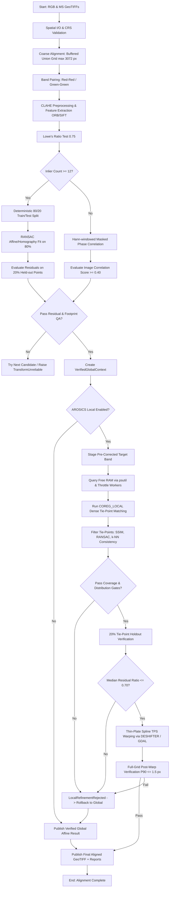

# Deep Architectural Guide: AgriLift Automated Drone Alignment Engine

> **Document Version:** 4.0 (Production Architecture)  
> **System:** `drone_alignment` Subsystem  
> **Target Audience:** Remote Sensing Engineers, Software Engineers, DevOps & QA Teams

---

## Table of Contents

1. [Executive Summary & The Agricultural Multi-Modal Problem](#1-executive-summary--the-agricultural-multi-modal-problem)
2. [Architectural Overview: The Two-Tier Strategy](#2-architectural-overview-the-two-tier-strategy)
3. [Deep Pipeline Walkthrough](#3-deep-pipeline-walkthrough)
   - [Phase 1: Ingestion & Spatial Pre-Validation](#phase-1-ingestion--spatial-pre-validation)
   - [Phase 2: Common Grounding & Registration Grid Normalization](#phase-2-common-grounding--registration-grid-normalization)
   - [Phase 3: Cross-Spectral Feature Bridge & CLAHE Enhancement](#phase-3-cross-spectral-feature-bridge--clahe-enhancement)
   - [Phase 4: Keypoint Matching & The 80/20 Verification Split](#phase-4-keypoint-matching--the-8020-verification-split)
   - [Phase 5: Global Transform Estimation & Frequency Fallback](#phase-5-global-transform-estimation--frequency-fallback)
   - [Phase 6: AROSICS COREG_LOCAL Dense Subpixel Refinement](#phase-6-arosics-coreg_local-dense-subpixel-refinement)
   - [Phase 7: Multi-Stage Safety Gates & Rejection Architecture](#phase-7-multi-stage-safety-gates--rejection-architecture)
   - [Phase 8: Elastic Non-Rigid Warping & Tiled Streaming I/O](#phase-8-elastic-non-rigid-warping--tiled-streaming-io)
   - [Phase 9: Quality Assurance & Artifact Generation](#phase-9-quality-assurance--artifact-generation)
4. [Memory Architecture & RAM-Aware Concurrency Control](#4-memory-architecture--ram-aware-concurrency-control)
5. [Coordinate System Mathematics & Matrix Conjugation](#5-coordinate-system-mathematics--matrix-conjugation)
6. [End-to-End Pipeline Flowchart](#6-end-to-end-pipeline-flowchart)
7. [Safety Rejection Taxonomy & Diagnostic Codes](#7-safety-rejection-taxonomy--diagnostic-codes)
8. [Configuration & Parameter Tuning Guide](#8-configuration--parameter-tuning-guide)

---

## 1. Executive Summary & The Agricultural Multi-Modal Problem

In precision agriculture, Unmanned Aerial Vehicles (UAVs) capture orthomosaics across multiple camera payloads:
- **RGB Sensors:** High spatial resolution (e.g., $1.0\text{–}2.5\text{ cm/px}$), captured with wide-angle RGB rolling/global shutter lenses.
- **Multispectral (MS) Sensors:** Moderate spatial resolution (e.g., $3.5\text{–}8.0\text{ cm/px}$), typically captured across discrete narrowband sensors: Red ($668\text{ nm}$), Green ($560\text{ nm}$), RedEdge ($705\text{ nm}$), and Near-Infrared ($842\text{ nm}$).

### The Spatial Registration Challenge

Overlaying MS orthophotos directly onto RGB basemaps consistently reveals spatial distortions:
1. **GPS/IMU Absolute Position Drift:** Standard GNSS sensors exhibit $2\text{–}6\text{ m}$ of drift between independent flight passes, displacing the MS layer relative to RGB.
2. **Ground Sample Distance (GSD) Discrepancies:** Multispectral sensors have different focal lengths and detector pitches, resulting in distinct native pixel scales.
3. **Parallax and Elevation Variations:** Because RGB and MS passes are flown at different times or with separate camera pods, 3D crop canopies, trees, and terrain introduce non-rigid, local parallax shifts.
4. **Spectral Gradient Inversion:** Healthy crop canopies absorb strongly in the Red band (due to chlorophyll absorption) but reflect strongly in the Near-Infrared (due to leaf mesophyll scattering). Matching RGB against raw NIR fails because gradient vectors point in opposite directions.
5. **Periodic Texture Aliasing:** Agricultural crop rows repeat with uniform spacing ($0.75\text{–}1.5\text{ m}$). Standard correlation algorithms can easily match a crop row to an adjacent row, producing off-by-one aliasing.

The `drone_alignment` engine was designed specifically to overcome these challenges through an automated, dual-tier co-registration pipeline combining robust feature extraction, phase correlation, multi-core subpixel refinement, and rigorous multi-stage safety verification.

---

## 2. Architectural Overview: The Two-Tier Strategy

The engine implements a **Dual-Tier Hierarchical Alignment** strategy:

```
┌────────────────────────────────────────────────────────────────────────┐
│                        TIER 1: GLOBAL MACRO-ALIGNMENT                  │
│  - Bounding-box intersection and CRS harmonization                     │
│  - Downsampled low-resolution registration grid (max 3072 px)          │
│  - Cross-spectral Red-Red and Green-Green feature matching             │
│  - ORB/SIFT with Lowe's ratio test & RANSAC affine fitting             │
│  - Hann-windowed Masked Phase Correlation fallback                     │
│  - Independent 20% held-out spatial residual validation & footprint QA │
└───────────────────────────────────┬────────────────────────────────────┘
                                    │ Produces: VerifiedGlobalContext
                                    ▼
┌────────────────────────────────────────────────────────────────────────┐
│                  TIER 2: AROSICS SUBPIXEL MICRO-REFINEMENT             │
│  - Pre-corrected raster staging                                        │
│  - Dynamic RAM-aware CPU worker throttling (_compute_safe_cpus)        │
│  - COREG_LOCAL dense subpixel Fourier cross-power spectrum correlation │
│  - Multi-gate tie-point filtering: SSIM, RANSAC, k-NN neighbor check   │
│  - Distribution & hull coverage gates                                  │
│  - 20% holdout validation: requires median residual reduction          │
│  - Non-rigid Thin-Plate Spline (TPS) transformation                    │
│  - Full-grid post-warp verification on published output (P90 <= 1.5 px)│
└───────────────────────────────────┬────────────────────────────────────┘
                                    │
               ┌────────────────────┴────────────────────┐
               │ Any safety gate rejects?                │
               ▼                                         ▼
         [ YES: SAFE FALLBACK ]                   [ NO: ACCEPTED ]
    Gracefully publish verified              Publish TPS-refined
    global affine result without             subpixel GeoTIFF
    crashing or failing run                  with tie-point report
```

### Key Safety Principle: Conservative Rollback
Tier 2 (AROSICS local refinement) **never** acts as a fragile dependency. The global candidate is completely estimated, verified against independent held-out points, and validated against native footprint coverage before local refinement begins. If local refinement encounters insufficient tie points, irregular spatial distribution, crop-row aliasing, or fails the holdout test, the engine **immediately and safely rolls back** to publishing the verified global baseline.

---

## 3. Deep Pipeline Walkthrough

### Phase 1: Ingestion & Spatial Pre-Validation
- **Module:** [`drone_alignment.io.reader`](file:///d:/Internship%20Stuff/Agrilift/drone_alignment/io/reader.py), [`drone_alignment.io.validators`](file:///d:/Internship%20Stuff/Agrilift/drone_alignment/io/validators.py)
- **Functions:** `read_metadata()`, `validate_inputs()`

The system ingests the reference RGB GeoTIFF and target Multispectral GeoTIFF:
1. **Coordinate Reference System (CRS) Validation:** Ensures both rasters share identical projected coordinate systems (e.g., UTM Zone). If datums or projections differ, an explicit error is raised.
2. **Bounding Box Overlap:** Evaluates spatial intersection. The rasters must overlap by at least $10\%$ to proceed.
3. **Radiometric Check:** Inspects band counts and extracts nodata definitions (or creates valid masks from finite, non-zero values).

---

### Phase 2: Common Grounding & Registration Grid Normalization
- **Module:** [`drone_alignment.alignment.coarse`](file:///d:/Internship%20Stuff/Agrilift/drone_alignment/alignment/coarse.py)
- **Function:** `coarse_align()`

Processing raw multi-gigabyte rasters directly would exhaust memory and cause excessive latency. The engine normalizes the interaction into a unified low-resolution registration workspace:
1. **Buffered Mutual Bounding Box:** Determines the intersection polygon with a safety margin (default: $10\text{ m}$) clamped to the RGB reference extent. This margin ensures that large physical GPS offsets ($2\text{–}6\text{ m}$) do not push target pixels out of bounds.
2. **Registration Grid Resolution:** Downsamples the shared bounds so the longest dimension does not exceed `registration_max_dimension` (default: $3072\text{ px}$).
3. **Decoupled Grid Geometry:** Computes `coarse.registration_transform`, mapping low-resolution grid pixel indices to map coordinates.
4. **Valid Data Masks:** Rasterizes RGB and MS valid masks onto the registration grid to exclude black boundaries and flight margins.

---

### Phase 3: Cross-Spectral Feature Bridge & CLAHE Enhancement
- **Module:** [`drone_alignment.alignment.feature_detector`](file:///d:/Internship%20Stuff/Agrilift/drone_alignment/alignment/feature_detector.py)
- **Functions:** `preprocess_band()`, `detect_features()`

To solve the gradient inversion problem between RGB and Multispectral bands:
1. **Band Pairing:** The pipeline pairs spectrally matched bands:
   - Primary: RGB Red (Band 1) $\leftrightarrow$ MS Red (Band 1).
   - Secondary: RGB Green (Band 2) $\leftrightarrow$ MS Green (Band 2).
2. **Histogram Normalization (CLAHE):** Applies Contrast Limited Adaptive Histogram Equalization with a clip limit of $3.0$ and tile grid size of $8 \times 8$. This normalizes lighting differences, vignetting, and cloud shadows across sensor acquisitions.
3. **Keypoint Extraction:** Detects up to 10,000 features using:
   - **ORB (Oriented FAST and Rotated BRIEF):** Default fast detector.
   - **SIFT (Scale-Invariant Feature Transform):** High-precision fallback when ORB yields insufficient matches.

---

### Phase 4: Keypoint Matching & The 80/20 Verification Split
- **Module:** [`drone_alignment.alignment.feature_matcher`](file:///d:/Internship%20Stuff/Agrilift/drone_alignment/alignment/feature_matcher.py), [`drone_alignment.pipeline`](file:///d:/Internship%20Stuff/Agrilift/drone_alignment/pipeline.py)
- **Functions:** `match_features()`, `_split_estimation_and_verification()`

1. **Lowe's Ratio Test:** Compares the Euclidean distance of the best descriptor match ($d_1$) against the second-best ($d_2$):
   $$\frac{d_1}{d_2} < 0.75$$
   Matches exceeding this ratio are rejected as ambiguous.
2. **Deterministic Independent Verification Split:**  
   Before running RANSAC, the matched point pairs are deterministically partitioned:
   - **80% Training Set:** Handed to RANSAC for model estimation.
   - **20% Independent Verification Set:** Kept completely isolated from RANSAC.  
   This mathematical isolation guarantees that residual metrics reflect true out-of-sample geometric accuracy rather than overfitted inliers.

---

### Phase 5: Global Transform Estimation & Frequency Fallback
- **Module:** [`drone_alignment.alignment.transform_estimator`](file:///d:/Internship%20Stuff/Agrilift/drone_alignment/alignment/transform_estimator.py)
- **Functions:** `estimate_transform()`, `phase_correlation_global()`

1. **RANSAC Fitting:** Estimates a 2D Affine ($2 \times 3$) or Homography ($3 \times 3$) matrix using RANSAC with a reprojection threshold of $3.0\text{ px}$.
2. **Frequency-Domain Fallback:**  
   If feature detection yields fewer than 12 inliers (common in uniform crop canopies), the engine automatically falls back to **Hann-windowed Masked Phase Correlation**:
   - Applies a 2D Hann window to attenuate high-frequency boundary leakage.
   - Computes the Normalized Cross-Power Spectrum:
     $$R = \frac{F_{\text{RGB}}(\xi, \eta) \cdot F_{\text{MS}}^*(\xi, \eta)}{|F_{\text{RGB}}(\xi, \eta) \cdot F_{\text{MS}}^*(\xi, \eta)|}$$
   - Locates the phase correlation peak to determine global subpixel translation $(dx, dy)$.
   - Verifies the candidate with an image-domain correlation score $\ge 0.40$.
3. **Independent Spatial Residual QA:**  
   The held-out $20\%$ points are projected through the candidate transform. The engine evaluates:
   - Global Root Mean Square Error (RMSE).
   - Maximum residual error.
   - Spatial drift ratio across grid quadrants.
4. **Footprint Validation:**  
   Verifies that the warped raster retains $\ge 80\%$ valid source data and achieves $\ge 80\%$ reference overlap.

---

### Phase 6: AROSICS COREG_LOCAL Dense Subpixel Refinement
- **Module:** [`drone_alignment.alignment.arosics_local`](file:///d:/Internship%20Stuff/Agrilift/drone_alignment/alignment/arosics_local.py), [`drone_alignment.alignment.arosics_staging`](file:///d:/Internship%20Stuff/Agrilift/drone_alignment/alignment/arosics_staging.py)
- **Function:** `_refine_with_arosics_local()`

Once the global candidate is verified, AROSICS COREG_LOCAL performs dense micro-registration:
1. **Pre-Correction Staging:** The target MS band is pre-shifted by the verified global transform and written to a temporary staged GeoTIFF. This ensures that AROSICS only needs to solve small residual displacements ($< 0.5\text{ m}$), eliminating large-scale search ambiguities.
2. **Tie-Point Grid Initialization:** A regular grid (e.g., $16 \times 16$ points) is generated across the overlapping extent.
3. **Local Window Matching:** For each grid point, matching windows (e.g., $256 \times 256\text{ px}$) are extracted and evaluated via subpixel Fourier phase correlation.

---

### Phase 7: Multi-Stage Safety Gates & Rejection Architecture

Every tie point and candidate field must pass through a hierarchy of strict verification gates:

```
[ AROSICS Raw Points ]
         │
         ▼ Gate 1: Reliability & SSIM Filter
   reliability >= 60.0% & SSIM check
         │
         ▼ Gate 2: RANSAC Spatial Model Filter
   Removes global geometric outliers
         │
         ▼ Gate 3: k-NN Spatial Neighbor Consistency Filter
   Flags points whose vector deviates > 2.0 px from median of k=6 nearest neighbors
   (CRITICAL: Prevents off-by-one crop-row aliasing)
         │
         ▼ Gate 4: Coverage & Distribution Gates
   Valid tie points >= 12
   Cell occupancy >= 50% (grid density 4x4)
   Convex hull coverage >= 30% of overlap area
         │
         ▼ Gate 5: 20% Holdout Cross-Validation
   20% tie points reserved prior to TPS fit
   median(residual_after) <= 0.70 * median(residual_before)
   At least 60% of holdout points must show improved alignment
         │
         ▼ Gate 6: Full-Grid Post-Warp Verification
   Runs COREG_LOCAL on final published raster: 90th percentile residual <= 1.5 px
```

If **any** gate fails, the engine raises `LocalRefinementRejected`, intercepts the exception, and immediately publishes the verified global baseline.

---

### Phase 8: Elastic Non-Rigid Warping & Tiled Streaming I/O
- **Module:** [`drone_alignment.alignment.warper`](file:///d:/Internship%20Stuff/Agrilift/drone_alignment/alignment/warper.py)
- **Functions:** `warp_ms_to_rgb_tiled()`, `ArosicsDeshifterWarpEngine`, `GdalTpsWarpEngine`

1. **Warp Engine Selection:**
   - **DESHIFTER Engine (AROSICS native):** Used when in-memory footprint is within limits ($\le 4\text{ GB}$). Applies AROSICS' built-in Thin-Plate Spline interpolation.
   - **GDAL TPS Engine:** Automatically selected for large datasets. Converts tie points into GDAL Ground Control Points (GCPs) and streams the thin-plate-spline warp in blocks via `gdal.Warp()`.
2. **Tiled Streaming Output:** Writes Cloud-Optimized GeoTIFF (COG) compatible tiles ($512 \times 512\text{ px}$) with DEFLATE/LZW compression and horizontal differencing predictor to ensure low memory consumption during disk export.

---

### Phase 9: Quality Assurance & Artifact Generation
- **Module:** [`drone_alignment.quality.visualization`](file:///d:/Internship%20Stuff/Agrilift/drone_alignment/quality/visualization.py), [`drone_alignment.quality.report`](file:///d:/Internship%20Stuff/Agrilift/drone_alignment/quality/report.py)

1. **Output GeoTIFF:** `<ms_stem>_aligned.tif` (all MS bands warped with exact spatial alignment).
2. **Visual Inspection Overlay:** `<ms_stem>_alignment_preview.png` (false-color composite: RGB Red in Red channel, MS Red in Green channel. Misalignments appear as red/green fringing; perfect alignment appears yellow).
3. **Detailed JSON Audit Trail:** `<ms_stem>_alignment_report.json` containing:
   - Full transform parameters.
   - Inlier match counts and ratio.
   - Spatial residual statistics (RMSE, max drift).
   - AROSICS gate decisions and holdout ratios.
4. **Tie Points CSV:** `<ms_stem>_tie_points.csv` containing map coordinates, shift vectors ($dx, dy$), reliability scores, and classification.

---

## 4. Memory Architecture & RAM-Aware Concurrency Control

### Why AROSICS Can Exhaust RAM

AROSICS parallelizes subpixel window matching using the Python `loky` process pool. Because Python processes cannot share raw C-level NumPy arrays across memory without serialization or copy-on-write overhead, **every worker process loads both the reference raster and the target raster into memory as float32 arrays**:

$$\text{Bytes Per Worker} \approx 2 \times (\text{Width} \times \text{Height} \times 4\text{ bytes}) \times 1.35$$

For an orthomosaic of dimensions $12,000 \times 12,000$:
$$\text{Single Band Float32} = 12000 \times 12000 \times 4 \approx 576\text{ MB}$$
$$\text{Per-Worker Allocation} = 2 \times 576\text{ MB} \times 1.35 \approx 1.55\text{ GB per worker}$$

On an 8-core CPU, running 8 parallel workers would demand:
$$8 \times 1.55\text{ GB} \approx 12.4\text{ GB of RAM}$$

On a machine with 16 GB total RAM (with 6–8 GB already used by Windows, IDEs, and browser tabs), available RAM is often only 6–8 GB. In this situation, the operating system kernel silently terminates worker processes without throwing a Python `MemoryError`. On Windows, this appears as an instantaneous crash or exit code without a traceback.

---

### The Built-in Protective Throttling Algorithm

To protect against unexpected crashes, the engine implements dynamic memory inspection via [`_compute_safe_cpus()`](file:///d:/Internship%20Stuff/Agrilift/drone_alignment/alignment/arosics_local.py#L52):

```python
# 1. Query instantaneous free memory via psutil
available_bytes = psutil.virtual_memory().available

# 2. Reserve 20% (minimum 512 MB) as safety buffer for OS and GDAL
reserve_bytes = max(512 * 1024**2, int(available_bytes * 0.20))
worker_budget = max(0, available_bytes - reserve_bytes)

# 3. Estimate memory footprint per worker
band_bytes = staged_width * staged_height * 4  # float32
per_worker_bytes = band_bytes * 2 * 1.35

# 4. If even 1 worker exceeds budget, reject early before crashing
if per_worker_bytes > worker_budget:
    raise LocalRefinementRejected("MEMORY_BUDGET", "Available RAM insufficient...")

# 5. Cap workers to fit strictly inside available budget
safe_cpus = max(1, int(worker_budget // per_worker_bytes))
effective_cpus = min(safe_cpus, configured_cpus or os.cpu_count())
```

---

## 5. Coordinate System Mathematics & Matrix Conjugation

Let:
- $\mathbf{x}_{\text{native}} = \begin{bmatrix} x_{\text{ms}} \\ y_{\text{ms}} \\ 1 \end{bmatrix}$ be target coordinates in native MS pixel space.
- $\mathbf{x}_{\text{reg}} = \begin{bmatrix} u \\ v \\ 1 \end{bmatrix}$ be coordinates in the downsampled registration grid.

The spatial mapping between native resolution and registration resolution is defined by the scaling matrix $S$:
$$S = \begin{bmatrix} \frac{\text{width}_{\text{native}}}{\text{width}_{\text{reg}}} & 0 & 0 \\ 0 & \frac{\text{height}_{\text{native}}}{\text{height}_{\text{reg}}} & 0 \\ 0 & 0 & 1 \end{bmatrix}$$

RANSAC or Phase Correlation computes the affine transformation matrix $T_{\text{reg}}$ in registration grid space:
$$\mathbf{x}'_{\text{reg}} = T_{\text{reg}} \cdot \mathbf{x}_{\text{reg}}$$

To apply this transformation directly to the native raster during tiled streaming warp, the matrix is mathematically conjugated:
$$T_{\text{native}} = S \cdot T_{\text{reg}} \cdot S^{-1}$$

This mathematical conjugation guarantees that registration performed at $3072\text{ px}$ maps with millimeter-level precision onto the native $20,000\text{ px}$ GeoTIFF.

---

## 6. End-to-End Pipeline Flowchart



---

## 7. Safety Rejection Taxonomy & Diagnostic Codes

When local refinement encounters data anomalies, it raises `LocalRefinementRejected` with one of the following standardized codes:

| Rejection Code | Trigger Condition | Engine Action |
|---|---|---|
| `MEMORY_BUDGET` | Available RAM cannot safely host even 1 AROSICS worker process. | Rolls back to verified global affine. |
| `INSUFFICIENT_TIE_POINTS` | Fewer than 12 valid tie points survive initial reliability and SSIM filtering. | Rolls back to verified global affine. |
| `POOR_COVERAGE` | Valid tie points occupy $< 50\%$ of grid cells or convex hull covers $< 30\%$ of overlap. | Rolls back to verified global affine. |
| `NEIGHBOUR_INCONSISTENT` | Excessive vectors deviate from their local $k$-NN cluster (crop-row aliasing). | Prunes points; if total drops below 12, rolls back. |
| `HOLDOUT_REGRESSION` | Thin-Plate Spline fails to reduce median residual on $20\%$ held-out points. | Rolls back to verified global affine. |
| `VERIFICATION_FAILED` | Post-warp validation on published raster shows 90th percentile residual $> 1.5\text{ px}$. | Rolls back to verified global affine. |

---

## 8. Configuration & Parameter Tuning Guide

Configuration is controlled via YAML or CLI flags:

```yaml
# config/alignment_config.yaml
transform:
  detector: "orb"                     # Primary detector: orb or sift
  max_keypoints: 10000                # Feature budget
  lowe_ratio: 0.75                    # Lowe's ratio test threshold
  min_good_matches: 20                # Minimum required matches
  ransac_reproj_threshold: 3.0        # RANSAC threshold in pixels
  min_retained_valid_ratio: 0.80      # Minimum source pixel retention
  min_reference_overlap_ratio: 0.80   # Minimum reference overlap

arosics:
  enabled: true
  local:
    enabled: true
    target_points_per_axis: 16        # Grid density (16x16 = 256 points)
    window_size: [256, 256]           # FFT matching window in pixels
    min_reliability: 60.0             # AROSICS reliability threshold
    tie_point_filter_level: 3         # 0=none, 1=reliability, 2=SSIM, 3=RANSAC
    neighbour_filter: true            # Enable k-NN local consistency
    neighbour_k: 6                    # k nearest neighbors
    max_neighbour_deviation_px: 2.0   # Maximum allowed deviation in MS pixels
    min_valid_tie_points: 12          # Minimum points to proceed with TPS
    holdout_fraction: 0.20            # 20% holdout split
    max_holdout_ratio: 0.70           # Required error reduction (after <= 70% before)
    min_holdout_win_fraction: 0.60    # At least 60% of test points must improve
    warp_engine: "auto"               # "auto", "deshifter", or "gdal_tps"
    max_in_memory_warp_gb: 4.0        # Switch to GDAL streaming above 4 GB
```

---

## 9. Conclusion & Operational Best Practices

1. **Default to AROSICS Mode:** For high-value crop analytics (e.g. NDVI, VARI, NDRE), always use AROSICS local refinement (Mode `[3]` in `run_alignment.ps1`) to eliminate local parallax and canopy distortions.
2. **Monitor Available RAM:** When processing orthomosaics exceeding $10,000 \times 10,000$ pixels, ensure your workstation has at least $8\text{–}16\text{ GB}$ of free memory.
3. **Inspect the Visual Preview:** Always open `<ms_stem>_alignment_preview.png` after processing. A crisp composite with yellow canopy edges confirms successful co-registration.
